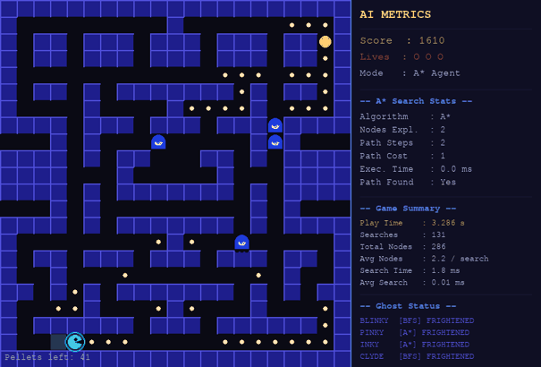

# Intelligent Pac-Man Agent

[](https://github.com/soumyadip2412/Pacman/actions/workflows/ci.yml)
[](https://github.com/soumyadip2412/Pacman/actions/workflows/pages.yml)

**[▶ Play it in your browser](https://soumyadip2412.github.io/Pacman/)**

A Pac-Man game in Python and Pygame where Pac-Man plays itself. It plans with **A\*** search, routes around ghosts, and always heads for the pellet that is nearest by maze distance. Four ghost agents chase it using BFS and A\*. The game draws each search live (the nodes A\* expanded and the path it chose), and a comparison screen runs **A\*, BFS and DFS** on the same route.



## Results

All numbers come from `python benchmark.py` (headless, seeded, about 30 seconds).

**Search on this maze**, every ordered pair of the 209 reachable cells (43,472 searches per algorithm):

| Algorithm | Mean nodes expanded | Shortest path found |
|---|---|---|
| A\* (Manhattan heuristic) | **34.4** | 100% |
| BFS | 105.5 | 100% |
| DFS | 105.5 | 12% (paths 4.6x longer on average, up to 63x) |

A\* never expanded more nodes than BFS on any pair, so it does about 3x less work for the same optimal path.

**The AI agent**, 40 seeded games per difficulty:

| Difficulty | Wins | Lives lost per game |
|---|---|---|
| Easy | 40 / 40 | 0.20 |
| Medium | 40 / 40 | 0.45 |
| Hard | 23 / 40 | 2.15 |

## How Pac-Man decides

Every fourth tick Pac-Man runs **perceive → plan → act**:

1. **Perceive** its cell, the remaining pellets, and the ghosts that can hurt it (frightened ghosts are ignored).
2. **Plan**:
   - One multi-source BFS from the ghosts marks every cell within 2 steps of a ghost as a *danger zone*.
   - A multi-goal BFS finds the pellet nearest by maze distance that can be reached without entering the danger zone. Picking by straight-line (Manhattan) distance would sometimes choose a pellet 9 steps further away.
   - A\* plans the path to that pellet, treating the danger zone as walls.
   - If no pellet can be reached safely, Pac-Man flees one step toward the cell furthest from the nearest ghost.
3. **Act**: move one cell along the path. It replans when the path runs out, about every 16 ticks, or whenever a ghost is within 4 cells.

**Why Manhattan distance is a good heuristic here:** moves are up, down, left or right and cost 1 each. So Manhattan distance is the exact cost with no walls, and walls can only make a path longer. It never overestimates (admissible). It changes by exactly 1 per move (consistent), so A\* can safely close expanded nodes and still return the shortest path.

The search state is just `(row, col)`. The full "eat every pellet" problem would need position × remaining-pellet subsets (209 × 2^170 states), so the agent solves it greedily as a sequence of nearest-pellet subgoals.

## Ghosts

| Ghost | Search | Chase target |
|---|---|---|
| Blinky (red) | BFS | Pac-Man's cell |
| Pinky (pink) | A\* | 4 cells ahead of the direction Pac-Man is moving |
| Inky (cyan) | A\* | Pac-Man's cell |
| Clyde (orange) | BFS | Pac-Man when more than 8 cells away, otherwise its home corner |

All ghosts alternate 300 ticks of chase with 150 ticks of scatter (each heads to its home corner). A power pellet frightens every ghost once for 200 ticks: frightened ghosts wander randomly and can be eaten for 200 points.

## Run it locally

Requires Python 3.10+.

```bash
git clone https://github.com/soumyadip2412/Pacman.git
cd Pacman
pip install -r requirements.txt
python main.py
```

| Key | Action |
|---|---|
| `Enter` / click Start | Start (choose difficulty and AI / manual on the start screen) |
| `Space` | Toggle AI / manual control |
| Arrow keys / `WASD` | Move manually |
| `V` | Toggle the search overlay (explored nodes and planned path) |
| `C` | Compare A\*, BFS and DFS on Pac-Man's current route |
| `R` | Restart |
| `Esc` | Quit |

## Project structure

```
main.py        Window, screens, input and rendering (async so it also runs in the browser)
game.py        Game state and rules, advanced one tick at a time with no drawing
pacman.py      Pac-Man agent: perceive → plan (danger zone, target, A*) → act
ghost.py       Ghost agents: chase / scatter / frightened, BFS or A* movement
astar.py       A* search and nearest-pellet planning
bfs.py         BFS, multi-goal BFS (nearest target) and multi-source BFS (distance map)
dfs.py         Iterative DFS (for the comparison screen)
maze.py        Maze layout, validation, neighbours and drawing
utils.py       Heuristics, metrics record, colours
benchmark.py   Reproduces the Results tables
tests/         pytest suite (search, maze, agent, game rules, rendering)
```

`game.py` keeps the rules separate from Pygame drawing, so the whole game runs headlessly in tests and in `benchmark.py`. Ghost randomness comes from a seeded `random.Random`, so the same seed replays the same game exactly.

## Development

```bash
pip install -r requirements-dev.txt
ruff check .
pytest               # 48 tests, about 10 seconds
python benchmark.py  # regenerate the Results tables
```

GitHub Actions runs lint and tests on Python 3.10 and 3.12 for every push and pull request. Every push to `main` also builds a WebAssembly version with [pygbag](https://github.com/pygame-web/pygbag) and publishes it to GitHub Pages.

## Known limitations

- The agent is greedy: it eats the nearest safe pellet next rather than planning a whole route, so it can walk into dead ends that a ghost then closes off. That is why it loses about 40% of games on Hard.
- Pac-Man does not hunt frightened ghosts. It only eats them when they get in its way.
- Ghost danger uses distance only, not the direction the ghost is moving.
