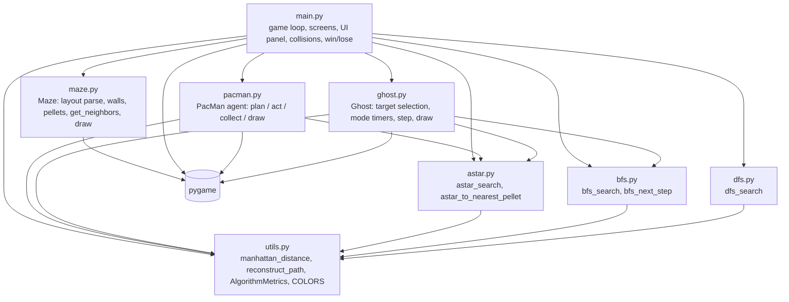

# Interview Preparation: Intelligent Pac-Man Agent

This is a hostile-but-fair walkthrough of this repository, written to prepare you to defend it in a technical interview. Every claim below was checked against the code at commit `11e36d8` (the only commit). Line references use `file:line`.

**Legend used throughout**

- **VERIFIED**: I read the code path and confirmed it.
- **MEASURED**: I ran the repo's own functions in a headless script outside the repo (method in [Appendix A](#appendix-a-how-the-measurements-were-made)). These numbers are not produced by anything in the repo.
- **NOT VERIFIED FROM CODE**: a claim in the docs (or a common assumption) that the code cannot confirm.
- **NOT PRESENT IN REPO**: a topic from the interview brief (backend, database, auth, RBAC, Docker, CI, tests...) that this project simply does not have. Say so plainly in an interview. Inventing it is the fastest way to fail.

---

## Table of contents

0. [Read this first: what this project is not](#0-read-this-first-what-this-project-is-not)
1. [Project overview](#1-project-overview)
2. [Architecture](#2-architecture)
3. [Important files](#3-important-files)
4. [Core workflows (step-by-step traces)](#4-core-workflows-step-by-step-traces)
5. [Technology decisions](#5-technology-decisions)
6. [Security model](#6-security-model)
7. [Data model (there is no database)](#7-data-model-there-is-no-database)
8. [Testing strategy](#8-testing-strategy)
9. [Interviewer attack surface](#9-interviewer-attack-surface)
10. [Documentation vs. code: claims that do not hold](#10-documentation-vs-code-claims-that-do-not-hold)
11. [60 interview questions](#11-60-interview-questions)
12. [15 interviewer traps](#12-15-interviewer-traps)
13. [Failure scenarios](#13-failure-scenarios)
14. [Honest assessment: weak points](#14-honest-assessment-weak-points)
15. [Strong talking points](#15-strong-talking-points)
16. [DEFEND THIS PROJECT: 30 / 60 / 120-second and deep-dive explanations](#16-defend-this-project)
17. [Final revision checklist](#17-final-revision-checklist)
18. [TOP 20 THINGS I MUST KNOW BEFORE INTERVIEW](#18-top-20-things-i-must-know-before-interview)
- [Appendix A: how the measurements were made](#appendix-a-how-the-measurements-were-made)

---

## 0. Read this first: what this project is not

The interview brief assumed a web stack (Express, MongoDB, JWT, RBAC, Docker, Playwright). **None of that exists here.** This repository is a **single-process, offline, single-player Python desktop game** built on Pygame. Know this cold, because an interviewer who opens the repo will see it in five seconds.

| Brief asked about | Status in this repo |
|---|---|
| Frontend source | Pygame drawing code in `main.py`, `maze.py`, `pacman.py`, `ghost.py` (no web frontend) |
| Backend / routes / controllers / services / middleware | **NOT PRESENT IN REPO** |
| API design | **NOT PRESENT IN REPO**. The only "APIs" are Python function signatures between modules |
| Database / models / migrations / seeding | **NOT PRESENT IN REPO**. All state is in memory; the "seed data" is the hard-coded `MAZE_LAYOUT` (`maze.py:45`) |
| Authentication / authorization / RBAC | **NOT PRESENT IN REPO** |
| Validation | **NOT PRESENT IN REPO** (the maze layout is never validated) |
| Error handling | One `try/except` in the whole codebase (`get_font`, `main.py:60-63`) |
| Logging / audit logs | **NOT PRESENT IN REPO**. `REPORT.md:69` and `REPORT.md:83` claim logging / an optional CSV log; the code has neither |
| State management | Plain mutable Python objects and local variables inside `run_game` (`main.py:506`) |
| Tests / Playwright / E2E | **NOT PRESENT IN REPO** (zero test files) |
| Docker / deployment / CI/CD | **NOT PRESENT IN REPO** |
| Scripts | `generate_ppt.py` (builds a slide deck with `python-pptx`, which is not in `requirements.txt`) |

If an interviewer asks "how does auth work?", the strong answer is: *"There is none, because it is an offline single-player desktop game with no network, no accounts and no persisted data. If I added online leaderboards, here is what I would have to add..."* (see [Section 6](#6-security-model)).

---

## 1. Project overview

### What problem does it solve?
It is an **academic demonstration of search algorithms** (A\*, BFS, DFS) and the "intelligent agent" framing from Russell & Norvig, packaged as a playable Pac-Man clone. `README.md:3` calls it an "AI Academic Assignment". The value is pedagogical: you can watch A\* plan paths (green overlay), see the nodes it expanded (teal overlay), and press `C` to compare A\*, BFS and DFS on one route.

### Who are the users?
- An evaluator / examiner watching the demo.
- A player who can toggle between the AI agent and manual control (`SPACE`, arrow keys / WASD).
- No accounts, no multiple users, no network.

### What it actually does (VERIFIED)
1. Loads a fixed 22-row x 21-column maze (`maze.py:45-68`). **The docs say 21x21 (`viva_qa.md:22`, `viva_qa.md:205`); that is wrong. MEASURED: 22 x 21.**
2. Pac-Man, in AI mode, repeatedly runs A\* from its cell to **one** pellet (the pellet with the smallest Manhattan distance, `astar.py:147`) and walks the path one cell per move.
3. Four ghosts pick a target cell by personality and mode, then use BFS (Blinky, Clyde) or A\* (Pinky, Inky) to take one step toward it (`ghost.py:170-182`).
4. Collisions are checked by comparing grid cells (`main.py:628-643`). 3 lives. Power pellets frighten ghosts for 200 ticks.
5. A right-side panel shows the last A\* run's metrics and whole-game totals; `C` opens a BFS/DFS/A\* comparison table; an end screen shows a run summary.

### What it does NOT do (despite docs)
- **Pac-Man does not avoid ghosts.** A ghost within 4 cells only forces a replan (`pacman.py:158-167`), but `astar_search` receives no ghost information, so it returns the same ghost-oblivious path. The docstring's "removes that cell from the accessible area by temporarily marking it" (`pacman.py:148-151`) is **not implemented**. README's "Detect if ghost is on current planned path → replan (avoid ghost)" (`README.md:91-93`) is **not implemented**.
- **Pac-Man does not use power mode** (it never chases frightened ghosts; `powered` is only used for colour).
- **`perceive()` is never called** (`pacman.py:124`; grep finds no caller). The perceive → plan → act cycle is partially a label.
- **No CSV logging**, no reproducible experiment runner, no tests.

---

## 2. Architecture

### 2.1 Module graph (VERIFIED from imports)



Search modules are duck-typed against the maze: they only call `maze.get_neighbors(r, c)`. They do not import `maze.py`. That is the cleanest seam in the codebase and the one to talk about.

### 2.2 The "request lifecycle" here is the game tick

There are no HTTP requests. The equivalent is one iteration of the `while running:` loop in `run_game` (`main.py:560-699`), capped at `FPS = 30` (`main.py:40`) by `clock.tick(FPS)`.

```mermaid
sequenceDiagram
    participant Loop as main.run_game loop
    participant Ev as pygame events
    participant P as PacMan
    participant A as astar.py
    participant G as Ghost x4
    participant S as bfs.py / astar.py
    participant M as Maze

    Loop->>Loop: clock.tick(30); tick += 1
    Loop->>Ev: pygame.event.get()
    Ev-->>Loop: QUIT / ESC / R / SPACE / V / C / arrows
    alt not game_over and death_pause == 0
        Loop->>P: act(ghost_positions)
        Note over P: every 4th tick only (PACMAN_MOVE_DELAY)
        P->>P: plan(): replan if path empty, 15+ ticks, or ghost within 4
        P->>A: astar_to_nearest_pellet(maze, pos, pellets)
        A->>A: pick pellet by Manhattan distance, run A*
        A-->>P: path, explored, metrics, target
        P->>M: move one cell; discard pellet from maze.pellets
        Loop->>P: update_power()
        Loop->>G: update(pac_row, pac_col, pac_dir)
        Note over G: move only when tick_count % move_delay == 0
        G->>S: bfs_next_step or astar_search to target
        Loop->>G: frighten(200) if pacman.powered
        Loop->>Loop: collision check (same cell), win check
    else death_pause > 0
        Loop->>Loop: countdown, then reset PacMan + ghosts
    end
    Loop->>M: draw(maze_surf, explored, path)
    Loop->>G: draw
    Loop->>P: draw
    Loop->>Loop: draw_panel(); display.flip()
    opt game_over
        Loop->>Loop: end_screen() blocks until R or ESC
    end
```

### 2.3 Answers to the 20 architecture questions

| # | Question | Answer from the code |
|---|---|---|
| 1 | Problem solved | Demonstrate informed vs. uninformed search and agent design in a game (see §1). |
| 2 | Users | An examiner and a local player. No accounts. |
| 3 | Request lifecycle | One tick of `run_game` (§2.2). Events → Pac-Man act → power timer → ghosts update → frighten → collisions → win check → render → flip. |
| 4 | Frontend ↔ backend | **NOT PRESENT IN REPO.** Rendering and logic run in the same loop and share objects directly. `main.py` reads `pacman.path` / `pacman.explored_nodes` to draw overlays (`main.py:662-667`). |
| 5 | Authentication | **NOT PRESENT IN REPO.** |
| 6 | Authorization | **NOT PRESENT IN REPO.** |
| 7 | RBAC | **NOT PRESENT IN REPO.** |
| 8 | Data flow | `Maze` owns walls and pellet sets. `PacMan` mutates `maze.pellets` / `maze.power_pellets` directly (`pacman.py:243-252`). Ghost positions are copied into a list each tick (`main.py:604`) and passed to `pacman.act`. Metrics flow from search functions into `PacMan.metrics` and cumulative counters, then into `draw_panel` / `end_screen`. |
| 9 | Database layer | **NOT PRESENT IN REPO.** In-memory Python sets, dicts and lists (§7). |
| 10 | Error handling | Essentially none. Only `get_font` falls back if `SysFont` throws (`main.py:60-63`). `reconstruct_path` returns `[]` if a parent is missing (`utils.py:98-100`). Search functions return `[]` when no path exists. Any other exception crashes the game. |
| 11 | Validation | **NOT PRESENT IN REPO.** The layout is trusted. A layout without `'P'` makes `pacman_start` `None` and `PacMan.__init__` crashes on unpacking (`pacman.py:70`). A layout without `'G'` makes `spawns[i % len(spawns)]` divide by zero (`main.py:541`). |
| 12 | Security | Not a meaningful concern for an offline game; see §6 for what an interviewer can still probe. |
| 13 | Audit logs | **NOT PRESENT IN REPO.** Closest thing: cumulative counters on `PacMan` (`pacman.py:91-98`) shown on screen and discarded at exit. |
| 14 | Frontend state | Local variables in `run_game` (`show_overlay`, `game_over`, `won`, `tick`, `death_pause`, `game_started_at`) plus fields on `PacMan`/`Ghost`/`Maze`. Screens are nested blocking loops (`start_screen`, `end_screen`, `comparison_screen`), not a state machine. |
| 15 | API failure handling | **NOT PRESENT IN REPO** (no APIs). Search "failure" = empty path: Pac-Man simply does not move that tick (`pacman.py:216`); a ghost with `_next_step is None` stays still (`ghost.py:180`). |
| 16 | Routing | No URL routing. Keyboard "routing" is the `if/elif` chain at `main.py:569-597`. |
| 17 | Test structure | **NOT PRESENT IN REPO.** |
| 18 | Production behaviour | Runs locally with `python main.py`. Frame-locked at 30 FPS; all timers are tick counts, so on a slow machine the whole game (including power-pellet duration) slows down rather than skipping. No packaging, no crash reporting. "Works on Windows, macOS, and Linux" (`README.md:63`) is **NOT VERIFIED FROM CODE** (nothing platform-specific is present, but nothing was tested either). |
| 19 | Major dependencies | `pygame` (runtime), stdlib `heapq`, `collections.deque`, `dataclasses`, `time`, `random`, `math`. `numpy` is listed in `requirements.txt` but **never imported**. `python-pptx` is used by `generate_ppt.py` but **not listed**. |
| 20 | Architectural tradeoffs | Simplicity over separation (logic + rendering in one loop); tick-based determinism over frame-rate independence; single-target greedy planning over full-state planning; ghost-oblivious A\* over safety-aware planning; recomputation every move over caching. |

---

## 3. Important files

### `main.py` (708 lines): composition root, game loop, all screens
- **Why it exists:** wires everything together and owns game-level rules (collisions, lives, win).
- **Depends on:** every other module plus `pygame`.
- **Depended on by:** nothing (entry point, `main.py:707-708`).
- **Key functions:**
  - `run_game` (`main.py:506`): initialises Pygame, shows `start_screen`, builds agents through the closure `make_agents` (`main.py:525-544`), runs the loop.
  - `make_agents` rebinds `maze` via `nonlocal` so each restart gets fresh pellets (`main.py:526-527`). Ghost speeds are offsets from the difficulty delay: Blinky `-2`, Pinky `0`, Inky `+1`, Clyde `-1` (`main.py:532-537`). The README only documents the base delay (`README.md:178-182`).
  - Collision and scoring rules (`main.py:628-643`); win check (`main.py:646-648`); death pause of `FPS * 2` ticks (`main.py:641`).
  - `comparison_screen` (`main.py:300`): runs BFS, DFS, A\* once each on the same start/goal and shows a table.
  - `draw_panel` (`main.py:384`): the live metrics panel. Hard-codes ghost algorithms in `ghost_algo_map` (`main.py:462-465`), duplicating `ghost_defs`.
- **Edge cases / bugs:**
  - Two ghosts on Pac-Man's cell in the same tick remove **two** lives, because the loop does not `break` after a hit (`main.py:628-643`). MEASURED: happened in 10 of 120 simulated games.
  - Swap-through collisions are missed: if Pac-Man and a ghost exchange cells in one tick, neither ends on the other's cell. MEASURED: 20 swap-throughs across 120 simulated games.
  - `R` during play does not reset `game_started_at` (`main.py:573-576`), so "Play Time" keeps counting from the first game. Replay from the end screen does reset it (`main.py:697`).
  - `pac_dir` for Pinky is derived from `pacman.path[0]` (`main.py:611-614`). In manual mode `path` is stale, so the "direction" can be a non-unit vector like `(3, -2)` and Pinky's "4 cells ahead" target becomes nonsense (clamped to the grid at `ghost.py:113-114`). `pacman.direction` exists and would be correct.
  - Dead code: `for g in ghosts: ... if pacman.powered and g.frightened is False: pass` (`main.py:616-619`).
  - `elapsed_seconds` is wall-clock time (`main.py:659`), so time spent on the comparison screen counts as play time.
- **Scalability:** everything is on one thread; a slow search stalls rendering.

### `maze.py` (217 lines): the environment
- **Why:** parses `MAZE_LAYOUT`, answers `is_wall` / `get_neighbors`, draws the board.
- **Depended on by:** every agent and search function (through `get_neighbors`).
- **Key design:** walls and pellets are `set`s of `(row, col)` tuples (`maze.py:91-93`), giving O(1) membership. `is_wall` treats out-of-bounds as a wall (`maze.py:128-132`), so searches never index outside the grid.
- **Facts (MEASURED):** 22 x 21 grid, 241 walls, 221 walkable cells, **209 reachable** from Pac-Man's start, 166 pellets + 4 power pellets = 170 collectibles. The 12 unreachable cells are the "tunnel" stubs at rows 8 and 12, columns 0-2 and 18-20: they look like wrap-around tunnels but there is **no wrap-around logic**, and they are walled off.
- **Average branching factor (MEASURED):** 2.22 over reachable cells (148 cells with 2 neighbours, 46 with 3, 10 dead ends, 5 with 4). `viva_qa.md:217` says "b ≈ 3".
- **Dead data:** `self.grid` (`maze.py:97`) is built but never read anywhere. `total_pellets` (`maze.py:121`) is never read. `pixel_to_cell` is never called.
- **Coupling smell:** `maze.py` imports `pygame` at module level (`maze.py:22`), so you cannot import the search-relevant `Maze` class without Pygame installed.
- **Ghost house:** cells `(9,9)-(9,11)` are open, so the "ghost house" has no door. Ghosts walk straight out, and Pac-Man can walk in.

### `astar.py` (150 lines): A\* and target selection
- `astar_search` (`astar.py:34`):
  - Open list is a `heapq` of `(f, g, node)` (`astar.py:56`).
  - **Lazy deletion:** duplicates are allowed in the heap; stale entries are skipped with `if current in explored: continue` (`astar.py:73-74`). No decrease-key.
  - Relaxation: `if tentative_g < g_score.get(neighbour, inf)` then update `came_from`, `g_score` and push (`astar.py:100-106`).
  - Returns `(path, explored, metrics)`; `metrics.path_cost = g` (`astar.py:89`).
  - **Tie-breaking:** on equal `f`, the tuple comparison pops the **lower** `g` first. The comment says "FIFO order" (`astar.py:54`) and `viva_qa.md:48` says "higher g". Both are wrong. See Trap 3.
- `astar_to_nearest_pellet` (`astar.py:121`):
  - Docstring says it runs A\* to every pellet and returns the lowest path cost (`astar.py:126-127`). **The code does not.** It picks the single pellet with the smallest **Manhattan** distance (`astar.py:147`) and runs A\* to it once. MEASURED: with the full pellet set, 27 of the 39 reachable non-pellet cells pick a pellet that is not the true nearest by maze distance, costing up to 9 extra steps.
- **Optimality claim:** holds for `astar_search` itself (MEASURED: A\* path length equals BFS path length for all 43,472 ordered pairs of reachable cells). It does **not** hold for "go to the nearest pellet", and it certainly does not make the overall pellet-collection tour optimal.

### `bfs.py` (132 lines)
- `bfs_search` (`bfs.py:31`): FIFO `deque`; `came_from` doubles as the visited set, marked **on enqueue** (`bfs.py:81-83`). Because a node is enqueued at most once, the `if current in explored: continue` check (`bfs.py:59-60`) can never fire. It is harmless but redundant.
- `bfs_next_step` (`bfs.py:98`): used by Blinky and Clyde. Runs a full BFS until the goal is dequeued, then walks parents back to the first step. Returns `None` if `start == goal` **or** if the goal is unreachable. The caller cannot tell those apart.
- It still builds the full `came_from` map; "without storing the entire path" (`bfs.py:102-103`) is true only in the narrow sense that it does not return it.

### `dfs.py` (104 lines)
- Iterative DFS with an explicit stack of `(node, depth)` (`dfs.py:55`).
- A node can be pushed multiple times; it is expanded once (`explored`). `came_from` is written only on **first discovery** (`dfs.py:90-91`), not when the node is actually expanded. The returned path is therefore a valid path in the "first-discoverer" tree, **not** the path DFS actually walked. It is still a valid, contiguous path.
- `max_depth=500` (`dfs.py:31`) can never trigger on 209 reachable cells; it is a safety net that is irrelevant here.
- MEASURED: DFS paths average **4.6x** the optimal length over all pairs, up to **63x**. The docs claim "2-3x" (`viva_qa.md:138`, `report_outline.md:192`).
- DFS is used **only** in the comparison screen. No agent uses it.

### `pacman.py` (385 lines): the agent
- Constants (`pacman.py:37-41`): `REPLAN_TICKS = 15`, `PACMAN_MOVE_DELAY = 4`, `DANGER_DIST = 4`. `MOVE_SPEED` and `target_px/py` are **unused** (no pixel interpolation; Pac-Man snaps cell to cell).
- `plan` (`pacman.py:139`): replans if the path is empty, `ticks_since_replan >= 15`, or any ghost is within Manhattan distance 4. The replan call itself ignores ghosts.
- `act` (`pacman.py:191`): increments counters every tick, but only moves (and only plans) when `move_tick % 4 == 0`. So the periodic replan effectively fires every 16 ticks (every 4th move), not every 15.
- `_collect_pellet` (`pacman.py:240`): +10 per pellet, +50 per power pellet, sets `power_timer = 200`.
- `handle_key` (`pacman.py:349`): any arrow/WASD key **also switches to manual mode**.
- Dead code in `draw`: the `for i in range(steps+1)` loop computes and discards `a` (`pacman.py:289-292`); `glow_alpha` is computed and unused (`pacman.py:318`); `rect` at `pacman.py:294` is unused.

### `ghost.py` (255 lines): ghost agents
- `_get_target` (`ghost.py:88`):
  - Frightened: random walkable neighbour (`ghost.py:99-102`). Uses the global `random` module, unseeded.
  - Scatter: fixed corner (`ghost.py:104-105`, `ghost.py:42-47`).
  - Chase: Blinky = Pac-Man's cell; Pinky = 4 cells ahead (falls back to Pac-Man's cell if that is a wall); **Inky = Pac-Man's cell, identical to Blinky** (`ghost.py:120-121`); Clyde = Pac-Man if Manhattan distance > 8, else his corner.
- `update` (`ghost.py:135`): scatter/chase alternation for **every** ghost (300 ticks chase, 150 scatter, `ghost.py:30-31`), so README's "Inky alternates scatter/chase" (`README.md:130`) describes all four ghosts, not a personality.
- **Replan cache does nothing useful:** `_next_step` is set to `None` after every move (`ghost.py:182`), so the `self._next_step is None` branch (`ghost.py:170`) forces a fresh search on every move. `plan_every = 8` never saves work.
- Ghost docstring calls them "Utility-Based / Reactive" (`ghost.py:6`). There is no utility function; they are simple reflex agents with a target rule plus a shortest-path step.
- `eaten` is set but never read.

### `utils.py` (167 lines)
- `manhattan_distance` (`utils.py:49`), `reconstruct_path` (`utils.py:81`), `AlgorithmMetrics` dataclass (`utils.py:109`).
- **Off-by-one:** `AlgorithmMetrics.path_length` is documented as "number of steps" (`utils.py:117`) but all three searches store `len(path)`, which includes the start cell (`astar.py:86`, `bfs.py:72`, `dfs.py:76`). So the panel's "Path Steps" shows steps + 1, while "Path Cost" shows the true step count.
- **Wrong claim:** `euclidean_distance` docstring says Euclidean "can overestimate for 4-directional grids" (`utils.py:73-75`). False: Euclidean ≤ Manhattan always, so it is admissible (just weaker). `viva_qa.md` Q9 gets this right, so your own docs contradict each other.
- Unused: `Timer`, `cell_rect`, `clamp`, `DIRECTIONS`, `euclidean_distance`, `Optional`, `field`.

### Documentation and scripts
- `README.md`, `REPORT.md`, `report_outline.md`, `viva_qa.md`: academic write-ups. Several numbers in them are wrong or hypothetical (§10). `REPORT.md:589` ends with leftover assistant text ("If you want, I can now add an automated CSV logger..."). An interviewer who notices will ask who wrote the report.
- `viva_qa.md:64` contains a broken image embed inside a word ("problem"); `image.png` is otherwise unreferenced.
- `generate_ppt.py`: 10-slide deck via `python-pptx`; writes `slides.pptx` to the working directory. Uses `<br/>` in one slide string, then replaces it with newlines (`generate_ppt.py:34`).

---

## 4. Core workflows (step-by-step traces)

### 4.1 Startup → first move
1. `python main.py` → `run_game()` (`main.py:707-708`).
2. `pygame.init()`, window caption, `Maze()` parse (`main.py:508-511`).
3. `start_screen` loops until Enter or the Start button, returning `(difficulty, ai_mode)` (`main.py:108-142`).
4. `make_agents()` builds a fresh `Maze`, a `PacMan`, and 4 `Ghost`s. Only two `'G'` spawns exist, so Blinky and Inky both spawn at `(10, 8)`, Pinky and Clyde at `(10, 12)` (`main.py:539-541`).
5. Tick 1-3: `pacman.act` increments counters and returns (move gate). Ghosts count ticks.
6. Tick 4: `move_tick % 4 == 0` → `plan()` → `ticks_since_replan` (initialised to 15, now 19) ≥ 15 → `astar_to_nearest_pellet` → path stripped of start (`pacman.py:179`) → `_follow_path` moves one cell and collects.

### 4.2 A\* planning trace (one call)
`PacMan.plan` → `astar_to_nearest_pellet(maze, (r,c), pellets ∪ power_pellets)`
→ `min(pellets, key=manhattan)` (O(P), P ≤ 170)
→ `astar_search(maze, start, candidate)`
→ push `(h(start), 0, start)` → loop: pop min `(f, g, node)`; skip if in `explored`; add; goal test; for each neighbour not in `explored`: relax with `g+1`, push `(g+1+h, g+1, n)`
→ `reconstruct_path(came_from, start, goal)`
→ back in `plan`: store `path[1:]`, `target_pellet`, `explored_nodes`, `metrics`; bump cumulative counters.

MEASURED: in real gameplay the average A\* call expands only **~4.7 nodes**, because the Manhattan-nearest pellet is almost always 1-2 cells away. The dramatic "A\* vs BFS" gap only shows up on long routes.

### 4.3 Ghost step trace
`Ghost.update(pr, pc, pac_dir)`
→ increment timers → frightened countdown → chase/scatter switch (only if not frightened)
→ return unless `tick_count % move_delay == 0`
→ `target = _get_target(...)`
→ `_next_step` is always `None` here (consumed last move) → BFS (`bfs_next_step`) or A\* (`astar_search(...)[0][1]`)
→ move to `_next_step`, set it to `None`.

### 4.4 Collision / power trace
After all agents move:
1. If `pacman.powered`, every ghost that is **not** frightened gets `frighten(200)` (`main.py:622-625`). This runs **every tick** while powered, so a ghost eaten and reset (`reset` clears `frightened`) is **immediately re-frightened with a fresh 200 ticks**, outliving Pac-Man's power.
2. For each ghost on Pac-Man's cell: frightened → ghost reset to spawn, +200; otherwise → lose a life, `dead = True`, `death_pause = 60` ticks, `game_over` if lives ≤ 0. No `break`, so multiple hits in one tick each cost a life.
3. Win check: 0 pellets left and not game over.
4. During `death_pause`, logic is frozen; at 0, Pac-Man and ghosts reset. Pellets are **not** restored.

### 4.5 Comparison screen trace (`C`)
`main.py:584-593`: goal = Manhattan-nearest pellet from Pac-Man → `comparison_screen` runs `bfs_search`, `dfs_search`, `astar_search` once each → shows nodes, path length, path cost, time (ms) → any key returns. The game loop is blocked meanwhile (timers do not advance, but wall-clock play time does). Because the goal is usually 1-3 cells away, the table often shows nearly identical numbers for all three algorithms; single-run timings in microseconds are noise.

---

## 5. Technology decisions

Only technologies actually in the repo.

### Python 3 (README says 3.10+)
- **Why used:** fast to write, readable algorithms, standard in AI coursework.
- **Problem solved:** rapid prototyping; `heapq`, `deque`, `dataclasses` in stdlib.
- **3.10+ is actually required:** `bfs.py:98` uses `tuple | None` in a return annotation, which is evaluated at definition time and needs Python 3.10, so older Pythons fail at import (VERIFIED by reading). `main.py:108` uses `tuple[str, bool]`, which needs 3.9.
- **Alternatives:** C++ / C# (Unity) / JavaScript (browser canvas).
- **Why choose an alternative:** performance for large maps (C++), shipping to users (Unity/web), zero-install demos (browser).
- **Tradeoff made:** interpreter overhead and awkward distribution in exchange for clarity. At 209 cells the overhead is irrelevant.

### Pygame
- **Why:** simple 2D drawing, event loop and clock in one library.
- **Problem solved:** window, input, per-frame drawing, frame cap (`clock.tick(FPS)`).
- **Alternatives:** Arcade, pyglet, Tkinter, a browser canvas, a text/terminal renderer.
- **Why an alternative:** Arcade/pyglet give GPU-accelerated sprites and cleaner scene abstractions; a terminal or headless renderer makes testing trivial.
- **Tradeoff made:** immediate-mode redraw of everything each frame (every wall is re-drawn with two highlight lines each frame, `maze.py:197-205`); logic and rendering coupled to Pygame, including `maze.py` importing it, which hurts testability.

### `heapq` (A\* open list)
- **Why:** O(log n) push/pop min-priority queue.
- **Alternative:** `queue.PriorityQueue` (thread-safe, slower, pointless here), a bucket queue (ideal for small integer f-values like these), a Fibonacci heap (theoretical decrease-key benefit, slower in practice).
- **Tradeoff:** no decrease-key, so the code uses **lazy deletion** (duplicate entries + `explored` check). With a consistent heuristic this is correct and simple.

### `collections.deque` (BFS frontier)
- **Why:** O(1) `popleft`. A plain list would make `pop(0)` O(n).
- **Alternative:** a list with a head index; `queue.Queue`.

### `dataclasses` (`AlgorithmMetrics`)
- **Why:** concise, typed record with defaults and a `summary()` helper (never called by the game).
- **Alternative:** `NamedTuple` (immutable), a plain dict.
- **Tradeoff:** mutable and unvalidated; fine here.

### `random` (frightened ghosts)
- Global, unseeded (`ghost.py:102`). Makes runs non-reproducible, which conflicts with REPORT's "reproducible metrics" claim (`REPORT.md:69`).

### `time.perf_counter`
- Used for search timing and play time. Correct choice (monotonic, high-resolution). Timing single sub-millisecond runs is noisy; no repetition or warm-up is done.

### `python-pptx` (only in `generate_ppt.py`)
- Generates the presentation. Not in `requirements.txt`.

### `numpy`
- Listed in `requirements.txt`, **never imported**. Be ready to say you would remove it.

### A\* with Manhattan distance (algorithmic choice)
- **Why:** 4-connected grid, unit step cost → Manhattan is admissible and consistent → A\* is optimal and never needs to reopen closed nodes.
- **Alternatives:** BFS (already optimal for unit costs, simpler, and for a *single-source multi-goal* query like "nearest pellet" actually the better fit), Dijkstra (needed only with non-uniform costs), greedy best-first (faster, not optimal), JPS (jump point search, big win on open grids, small win in corridors), precomputed all-pairs distances (209² ≈ 43.7k entries, trivially small here).
- **Tradeoff made:** A\* is optimal for one start/one goal, but the project's real question is "which pellet next?", which the code answers with a Manhattan guess. The optimality story is therefore narrower than the docs imply.

---

## 6. Security model

**There is no security model because there is no attack surface in the usual sense**: no network, no accounts, no files read, no persisted data. Say this confidently, then show you know what would change.

What an interviewer can still legitimately probe:

| Area | Current state | What to say |
|---|---|---|
| Untrusted input | Only keyboard/mouse events via `pygame.event.get()`. Unknown keys are ignored by `handle_key` (`pacman.py:361`). | Inputs are a closed set; no parsing. |
| Configuration input | `MAZE_LAYOUT` is hard-coded Python, never validated. | If layouts were loaded from files, validate rectangular shape, exactly one `P`, ≥ 1 `G`, allowed symbols, reachability of all pellets. |
| Dependencies | `requirements.txt` uses `>=` (unpinned), lists unused `numpy`, omits `python-pptx`. | Pin versions (or a lock file), remove unused, add missing; a new major Pygame could break rendering. |
| Resource exhaustion | Per tick up to 1 Pac-Man A\* + 4 ghost searches, each O(V log V) on 209 cells. No time budget. | Fine here; on large maps add a search budget or cache. |
| Integrity of results | Score computed client-side. | Irrelevant offline. For an online leaderboard: server-authoritative simulation or replay verification, signed/rate-limited submissions, authentication. |
| Reproducibility | `random` unseeded. | Seed from a CLI flag for experiments and bug repros. |
| Documentation integrity | Docs claim features the code lacks (§10). | This is the real "security" risk in an interview: credibility. |

Authentication, authorization, RBAC, JWT, sessions, CSRF, input sanitisation for web: **NOT PRESENT IN REPO**.

---

## 7. Data model (there is no database)

All data is in memory and lost at exit. **Database, schemas, migrations, seeding: NOT PRESENT IN REPO.**

| Entity | Representation | Where |
|---|---|---|
| Cell / state | `(row, col)` tuple | everywhere |
| Walls | `set[(r,c)]` | `Maze.walls` |
| Pellets / power pellets | two `set[(r,c)]`, mutated in place when eaten | `Maze.pellets`, `Maze.power_pellets` |
| Grid | 2-D list of 0/1, **unused** | `Maze.grid` |
| Spawns | `pacman_start` tuple, `ghost_starts` list (length 2) | `Maze` |
| Search bookkeeping | `came_from: dict`, `g_score: dict`, `explored: set`, heap/deque/list frontier | per call in `astar.py` / `bfs.py` / `dfs.py` |
| Search result metrics | `AlgorithmMetrics` dataclass | `utils.py:109` |
| Pac-Man | position, path, target, metrics, score, lives, power timer, cumulative counters | `PacMan` |
| Ghost | position, mode string, `frightened` bool, three timers, cached step | `Ghost` |
| Game-level | locals in `run_game` | `main.py:549-553` |

Design points to defend:
- **Sets of tuples** give O(1) `is_wall` and pellet checks and make "remaining pellets" a trivial `len`. A 2-D boolean array would be equally fast and more cache-friendly; the code builds one (`grid`) and then ignores it.
- **Layout encoding mixes `int` and `str`** (`1, 2, 3` and `'P', 'G'`). It works because the parser uses `==`, but it is a typed-data smell; an enum or a string map (`"#", ".", "o", "P", "G"`) is cleaner.
- **The search state is only `(row, col)`.** A true "collect all pellets" state would be `(position, remaining_pellets)`, which has 209 x 2^170 states: that is why the project decomposes the goal into "go to one pellet at a time". Know this; it is the most important modelling decision in the project.
- **Shared mutable `Maze`:** `PacMan` deletes pellets from the same object the renderer and win-check read. Simple, but any second consumer of pellet state (e.g., a replay recorder) would need to know about it.

---

## 8. Testing strategy

**There are no tests, no test framework, no CI and no E2E/Playwright.** Do not claim otherwise.

What you should be able to propose (and I verified is feasible, see Appendix A):

1. **Algorithm property tests (highest value):** for every ordered pair of reachable cells (43,472 pairs), assert `len(astar_path) == len(bfs_path)`, both paths are contiguous and wall-free, A\* expands ≤ BFS nodes. I ran exactly this; it passes.
2. **Unit tests:** `reconstruct_path` (start == goal, missing parent), `Maze` parsing counts (170 collectibles, 209 reachable), `bfs_next_step` returns `None` for `start == goal`.
3. **Regression tests for the known bugs:** double life loss, swap-through, `path_length` off-by-one.
4. **Headless simulation tests:** `SDL_VIDEODRIVER=dummy`, seed `random`, drive the tick logic without rendering, assert invariants (score never decreases, lives in 0..3, pellets monotonically decrease).
5. **Blocking issue:** the tick logic lives inline in `run_game`, so it cannot be called without also running the render loop. Extracting a `step(state) -> state` function is the prerequisite for any real testing.

---

## 9. Interviewer attack surface

For each feature: what you must understand, likely questions, follow-ups, common mistakes, weak decisions, alternatives, tradeoffs, scalability, security, failure scenarios.

### 9.1 A\* search (`astar.py`)
- **Must understand:** `f = g + h`; admissible vs consistent; why a closed set is safe with a consistent heuristic; lazy deletion; tie-breaking direction; why `came_from` is updated on relax, not on pop.
- **Likely questions:** "Why skip stale heap entries instead of decrease-key?" "Is your A\* correct with an inconsistent heuristic?" (No: once a node is closed it is never reopened, which is only safe under consistency.)
- **Follow-ups:** "Which node pops first when f ties?" (lower g). "Prove Manhattan is consistent here." (One move changes Manhattan by exactly ±1 and costs 1.)
- **Common mistakes:** saying A\* "is always faster than BFS" (in live play the difference is ~5 nodes); saying tie-breaking prefers deeper nodes.
- **Weak decision:** tie-break toward lower g; recomputing Manhattan on each push instead of caching is fine at this size.
- **Alternatives:** BFS (simpler, same optimality for unit costs), JPS, bucket-queue A\*.
- **Scalability:** O(E log V) per search; fine on 209 cells.
- **Failure scenarios:** unreachable goal → explores the whole component, returns `[]`.

### 9.2 Target selection (`astar_to_nearest_pellet`)
- **Must understand:** it is greedy Manhattan pre-selection, not "nearest by path". Docstring is wrong.
- **Likely question:** "Is your agent's pellet choice optimal?" Correct answer: no, neither locally (wrong nearest pellet up to 9 extra steps, MEASURED) nor globally (collecting all pellets is a TSP-like problem).
- **Better alternative:** one multi-goal BFS from Pac-Man that stops at the first pellet dequeued: exact nearest pellet, one search, and it is *cheaper* than the current Manhattan scan + A\* in the worst case.

### 9.3 Ghost avoidance (claimed) / replanning
- **Must understand:** it does not exist. `danger` only triggers a replan with the same ghost-blind A\*.
- **Likely questions:** "Show me where Pac-Man avoids a ghost." You cannot, so say so and explain how you would add it: add ghost cells and their neighbours as walls or as high-cost cells in the search (weighted A\*/Dijkstra), or pick targets away from ghosts, or use expectimax/minimax over a short horizon.
- **Evidence:** MEASURED win rate over 40 games each: Easy 24/40, Medium 19/40, Hard 15/40. Losses are ghost catches of an agent that never evades.

### 9.4 Ghost AI (`ghost.py`)
- **Must understand:** target rules per personality; all ghosts alternate scatter/chase; Inky == Blinky in chase; the replan cache is dead; frightened = random neighbour.
- **Likely questions:** "Why does Inky use A\* when its target equals Blinky's?" "Why search the entire maze every move when a precomputed distance map from Pac-Man would serve all four?"
- **Alternatives:** a single BFS "flow field" from Pac-Man per move serves every chaser in O(V); the original arcade logic picks the neighbour minimising Euclidean distance to the target with no search at all.

### 9.5 Game loop and collisions (`main.py`)
- **Must understand:** update order; tick gating; why swap-through is missed; why two lives can be lost at once; power-pellet re-frightening.
- **Likely questions:** "What if Pac-Man and a ghost move through each other?" "What if two ghosts catch Pac-Man on the same tick?"
- **Fixes:** check both "same cell after move" and "swapped cells"; `break` after the first non-frightened hit; frighten ghosts once, at pellet pickup, not every tick.

### 9.6 Metrics and the comparison screen
- **Must understand:** `path_length` counts the start cell; single-run timings are noise; one route (to a nearby pellet) is not a benchmark.
- **Likely question:** "How do you know A\* is better?" Strong answer: exhaustive all-pairs measurement (mean nodes 34.4 vs 105.5), not the in-game screen.
- **Interesting fact to show depth:** averaged over all goals, BFS and DFS explore the *same* mean number of nodes (105.5). For a fixed start, both expand cells in a goal-independent order, so the mean rank of a uniformly chosen goal is (N+1)/2 = 105.5 with N = 209 reachable cells, regardless of the order. A\* beats that because its expansion order depends on the goal.

### 9.7 Rendering / UI
- **Must understand:** full immediate-mode redraw each frame; nested blocking screens; unused interpolation fields; emoji in `draw_panel` (`main.py:414`) may render as boxes with Consolas.

### 9.8 Documentation
- **Must understand:** which claims are wrong (§10). An interviewer who has read your README and then your code will find them within minutes.

---

## 10. Documentation vs. code: claims that do not hold

| Claim | Where | Reality |
|---|---|---|
| Pac-Man avoids ghosts / replans around danger | `README.md:91-93`, `pacman.py:148-151`, `REPORT.md:534`, `viva_qa.md` Q16/Q18 | Replans but A\* ignores ghosts. **No avoidance.** |
| `astar_to_nearest_pellet` runs A\* to each pellet and returns the lowest cost | `astar.py:124-127` | Picks the Manhattan-nearest pellet, runs A\* once (`astar.py:147-149`). |
| Tie-break "explores in FIFO order" | `astar.py:54` | Lower g first on equal f; not FIFO. |
| Tie-break "prefers higher g" | `viva_qa.md:48`, `REPORT.md` Q22 | Opposite: lower g. |
| 21x21 maze | `viva_qa.md:22`, `:205` | 22 x 21. |
| ~300 reachable cells | `viva_qa.md:211` | 209 reachable (221 walkable). |
| b ≈ 3 | `viva_qa.md:217` | 2.22 measured. |
| A\* 60-120 nodes vs BFS 280+ | `viva_qa.md:22`, `:240`, `report_outline.md:185` | Impossible: BFS cannot exceed 209. Measured all-pairs mean: A\* 34.4, BFS 105.5, DFS 105.5. Live gameplay: ~4.7 per A\* call. |
| DFS paths 2-3x longer | `viva_qa.md:138`, `report_outline.md:192` | Mean 4.6x, max 63x. |
| Results table (280 / 320 / 78 nodes, ms timings) | `REPORT.md:422-428` | Labelled "hypothetical"; **NOT VERIFIED FROM CODE**; do not quote as results. |
| Euclidean can overestimate on 4-dir grids | `utils.py:73-75` | False; Euclidean ≤ Manhattan, so admissible. |
| Inky "alternates scatter/chase" as its personality | `README.md:130` | All ghosts alternate; Inky's chase target is identical to Blinky's. |
| Ghosts are "Utility-Based" agents | `ghost.py:6` | No utility function. |
| Perceive → plan → act cycle | `pacman.py:28`, README | `perceive()` is never called. |
| Optional CSV log / reproducible logging | `REPORT.md:69`, `:83` | Not implemented; RNG unseeded. |
| ≤ 60 FPS target | `REPORT.md:68` | `FPS = 30` (`main.py:40`). |
| `pygame==2.5.2` | `README.md:189` | `requirements.txt` says `pygame>=2.5.2`. |
| Project folder `AI AAT 1/` | `README.md:21` | Repo root is `Pacman`. Cosmetic. |
| Works on Windows/macOS/Linux, low-end laptops | `README.md:63` | **NOT VERIFIED FROM CODE**. |
| Pac-Man "Initial State (16, 10)" | `README.md:102` | Correct (VERIFIED). |
| Scores +10 / +50 / +200 | `REPORT.md` §6.5 | Correct (`pacman.py:245`, `:249`, `main.py:634`). |
| Difficulty delays 14 / 10 / 6 | `README.md:180-182` | Correct as base values; per-ghost offsets −2/0/+1/−1 are undocumented. |

---

## 11. 60 interview questions

Format per question: **Why asked** · **Strong answer must contain** · **Files** · **Difficulty** · **Follow-up**.

### A. Project Understanding (8)

**A1. In two sentences, what does this project do, and what does it deliberately not do?**
- Why asked: tests whether you can scope your own work honestly.
- Strong answer: offline Pygame Pac-Man where the player-agent uses A\* (Manhattan) to walk to the nearest-by-Manhattan pellet, ghosts chase using BFS/A\*, with overlays and a BFS/DFS/A\* comparison screen. It does not learn, does not avoid ghosts, has no network/persistence.
- Files: `README.md`, `main.py`, `pacman.py`
- Difficulty: Easy
- Follow-up: "Why did you stop there instead of adding ghost avoidance?"

**A2. Walk me through what happens between `python main.py` and Pac-Man's first step.**
- Why asked: checks you know the control flow, not just the algorithm.
- Strong answer: `run_game` → `pygame.init` → `Maze()` → `start_screen` blocking loop → `make_agents` → loop at 30 FPS → first move on tick 4 because of `PACMAN_MOVE_DELAY = 4`, plan forced because `ticks_since_replan` starts at 15.
- Files: `main.py:506-560`, `pacman.py:87`, `pacman.py:191-212`
- Difficulty: Medium
- Follow-up: "Why does `run_game` construct a `Maze` before the start screen and again in `make_agents`?"

**A3. What is the agent's goal, and where in the code is goal achievement detected?**
- Why asked: tests agent-design vocabulary vs. real code.
- Strong answer: goal = no pellets left; detected in `main.py:646-648`, not by the agent. The agent itself only has the sub-goal "reach target pellet".
- Files: `main.py:646-648`, `pacman.py:153-155`
- Difficulty: Easy
- Follow-up: "So is the agent goal-based, or is the game loop?"

**A4. What exactly is the state A\* searches over, and what information is missing from it?**
- Why asked: the central modelling decision.
- Strong answer: only `(row, col)`. Remaining pellets and ghost positions are not in the state. The full problem's state (position × pellet subset) is 209 × 2^170, so it is decomposed into single-pellet subproblems.
- Files: `astar.py:34`, `maze.py:134`
- Difficulty: Medium
- Follow-up: "What guarantee do you lose by decomposing?"

**A5. Why do you call Pac-Man a goal-based agent? Defend the label against the code.**
- Why asked: tests whether you parrot textbook labels.
- Strong answer: it plans multi-step action sequences toward a goal state, so it fits. But `perceive()` is never called, and the "reactive avoidance layer" is not implemented; honestly it is a goal-based planner with no adversarial reasoning.
- Files: `pacman.py:124-187`
- Difficulty: Medium
- Follow-up: "What would make it a utility-based agent?"

**A6. Describe each ghost's behaviour as implemented, not as documented.**
- Why asked: catches README-reciting.
- Strong answer: Blinky BFS to Pac-Man; Pinky A\* to 4 cells ahead (fallback to Pac-Man if wall); Inky A\* to Pac-Man (same as Blinky); Clyde BFS to Pac-Man if Manhattan > 8 else his corner; all alternate 300 chase / 150 scatter; frightened = random neighbour.
- Files: `ghost.py:88-131`, `ghost.py:155-161`
- Difficulty: Medium
- Follow-up: "Then why does Inky use A\* and Blinky BFS?"

**A7. What does the comparison screen actually measure, and is it a fair benchmark?**
- Why asked: tests scientific rigour.
- Strong answer: one run of each algorithm from Pac-Man to the Manhattan-nearest pellet. Not fair as a benchmark: one sample, usually a very short route, sub-ms timings with no repetition.
- Files: `main.py:300-311`, `main.py:584-593`
- Difficulty: Medium
- Follow-up: "Design a fair benchmark."

**A8. What happens when the user presses an arrow key during AI mode?**
- Why asked: detail knowledge.
- Strong answer: `handle_key` sets `manual_dir` **and** `manual_mode = True`, so any arrow switches to manual. SPACE toggles back.
- Files: `pacman.py:349-363`, `main.py:578-597`
- Difficulty: Easy
- Follow-up: "What does Pinky target in manual mode?" (stale `path[0]`, see C10/Trap 9)

### B. Architecture & Design (10)

**B1. Draw the module dependency graph. Which module is the composition root, and which seam is cleanest?**
- Why asked: architecture literacy.
- Strong answer: `main.py` is the root; search modules depend only on `utils` and a duck-typed `maze.get_neighbors`, making them the cleanest seam.
- Files: imports of all `.py`
- Difficulty: Easy
- Follow-up: "What stops you from unit-testing `Maze` without Pygame?" (`maze.py:22` imports pygame)

**B2. Why is the game tick-based rather than time-based? What breaks on a slow machine?**
- Why asked: real-time systems understanding.
- Strong answer: all timers (move delays, power 200, scatter 150, chase 300, death 60) count frames at a 30 FPS cap. Deterministic per frame; on a slow machine the game slows down uniformly rather than desyncing. Time-based (delta-time) would keep real-time speed but complicates grid movement.
- Files: `main.py:40`, `pacman.py:39-41`, `ghost.py:30-31`
- Difficulty: Medium
- Follow-up: "Play Time uses wall-clock. What inconsistency does that create?"

**B3. Where does game state live, and who is allowed to mutate it?**
- Why asked: ownership/coupling.
- Strong answer: split: locals in `run_game`, fields on `PacMan`/`Ghost`, and the shared `Maze` whose pellet sets `PacMan` mutates. `main.py` also mutates `pacman.score`, `pacman.lives`, `pacman.dead` directly. No single owner.
- Files: `main.py:549-553`, `main.py:634-641`, `pacman.py:240-252`
- Difficulty: Medium
- Follow-up: "How would you restructure into a single `GameState`?"

**B4. Why does `PacMan` delete pellets from `Maze` directly? What's the alternative?**
- Why asked: encapsulation.
- Strong answer: simplest possible; alternative is a `maze.consume(pos) -> points` method or an event returned from `act`, so scoring rules live in one place.
- Files: `pacman.py:240-252`
- Difficulty: Easy
- Follow-up: "Where do scoring rules live today?" (split: pellets in `pacman.py`, ghosts in `main.py:634`)

**B5. Why do all searches return `(path, explored, metrics)`? What does that cost?**
- Why asked: interface design.
- Strong answer: a uniform interface lets `comparison_screen` loop over them (`main.py:309`) and the overlay draw `explored`. Cost: allocation of the explored set every call, even for ghosts who discard it (`ghost.py:173-175`).
- Files: `astar.py`, `bfs.py`, `dfs.py`, `main.py:309-311`
- Difficulty: Medium
- Follow-up: "`astar_to_nearest_pellet` returns a 4-tuple. Is that a leaky interface?"

**B6. Explain the replanning policy and its real period.**
- Why asked: tests reading your own constants carefully.
- Strong answer: replan if path empty, `ticks_since_replan >= 15`, or ghost within 4. Since `plan` only runs on move ticks (every 4), the periodic replan fires every 16 ticks (every 4th move). Danger replans every move but produce the same path.
- Files: `pacman.py:39-41`, `pacman.py:157-172`, `pacman.py:198-209`
- Difficulty: Hard
- Follow-up: "Is there any case where periodic replanning changes the path?" (Only when pellets changed in a way that changes the Manhattan-nearest pick; since only Pac-Man eats pellets and it is walking toward its target, rarely.)

**B7. Is the ghost behaviour a state machine? Model it properly.**
- Why asked: design quality.
- Strong answer: it is two variables (`mode` string + `frightened` bool) with timers, so illegal combos exist (e.g. `mode='chase'` and `frightened=True`). A proper FSM would have `CHASE | SCATTER | FRIGHTENED | EATEN` with explicit transitions.
- Files: `ghost.py:74-79`, `ghost.py:150-161`, `ghost.py:184-188`
- Difficulty: Medium
- Follow-up: "`eaten` is never read. What was it for?"

**B8. Rendering and logic share one loop. What are the tradeoffs, and how would you separate them?**
- Why asked: architecture maturity.
- Strong answer: simple and synchronous, but untestable headless and a slow search stalls a frame. Separate into `update(state, input) -> state` and `render(state)`; optionally a fixed-timestep update with interpolated rendering.
- Files: `main.py:560-699`
- Difficulty: Medium
- Follow-up: "Where would the nested blocking screens go?"

**B9. Where is configuration duplicated, and what can drift?**
- Why asked: maintainability.
- Strong answer: `CELL_SIZE` defined in `maze.py:25`, `pacman.py:37`, `ghost.py:29`; ghost algorithm per name in `make_agents` and again in `draw_panel`'s `ghost_algo_map` (`main.py:462-465`); colours both in `COLORS` and local constants.
- Files: listed
- Difficulty: Easy
- Follow-up: "Which drift would silently show wrong information to the user?" (`ghost_algo_map`)

**B10. How would you add Greedy Best-First or UCS to the comparison screen? What in the current design helps or hurts?**
- Why asked: extensibility.
- Strong answer: write `greedy_search(maze, start, goal) -> (path, explored, metrics)`, add it to the list at `main.py:309`, add a row colour and optimal flag (`main.py:340-345`). The table layout is hard-coded to three rows; minor edit.
- Files: `main.py:300-378`
- Difficulty: Easy
- Follow-up: "Would greedy be optimal on this maze?"

### C. Core engine & module interfaces (this repo's equivalent of "Backend & APIs") (10)

**C1. Walk me through `astar_search` line by line.**
- Why asked: the core of the project.
- Strong answer: heap `(f,g,node)`, `g_score`, `came_from`, `explored`; pop; skip stale; mark explored; goal test on pop (not on push, which is required for optimality); relax neighbours not explored; push. Returns path/explored/metrics with `path_cost = g`.
- Files: `astar.py:34-118`
- Difficulty: Medium
- Follow-up: "Why must the goal test happen on pop, not on generation?"

**C2. Why `if current in explored: continue` instead of decrease-key?**
- Why asked: data-structure depth.
- Strong answer: `heapq` has no decrease-key; lazy deletion pushes duplicates and discards stale ones. Correct with a consistent heuristic because the first pop of a node has its optimal g.
- Files: `astar.py:73-74`
- Difficulty: Hard
- Follow-up: "What is the heap's worst-case size with lazy deletion?" (O(E))

**C3. On equal f, which node does your heap pop first? Why does it matter?**
- Why asked: trap for doc-reciters.
- Strong answer: lower g first (tuple ordering), then by node tuple. Comment says FIFO, viva says higher g; both wrong. Preferring higher g usually expands fewer nodes on grids, since among equal-f nodes the deeper one is closer to the goal.
- Files: `astar.py:54-56`, `astar.py:106`, `viva_qa.md:48`
- Difficulty: Hard
- Follow-up: "Change one character to prefer higher g." (`(f, -g, node)`)

**C4. Does `astar_to_nearest_pellet` return the nearest pellet?**
- Why asked: docstring vs code.
- Strong answer: no. Manhattan-nearest, then one A\*. MEASURED: wrong choice from 27/39 non-pellet cells, up to 9 extra steps. Fix: multi-goal BFS stopping at the first pellet.
- Files: `astar.py:121-150`
- Difficulty: Hard
- Follow-up: "Is multi-goal BFS more or less work than what you do now?"

**C5. In `bfs_search`, when does `if current in explored: continue` fire?**
- Why asked: tests precise reasoning.
- Strong answer: never. Nodes are marked visited on enqueue via `came_from`, so each is enqueued once. The check is redundant.
- Files: `bfs.py:56-83`
- Difficulty: Medium
- Follow-up: "What changes if you mark visited on dequeue instead?" (duplicates, more memory, still correct)

**C6. `bfs_next_step` returns `None` in two situations. What are they and how does the ghost react?**
- Why asked: edge-case handling.
- Strong answer: `start == goal`, or goal unreachable. The ghost just doesn't move. Indistinguishable to the caller.
- Files: `bfs.py:98-132`, `ghost.py:176-182`
- Difficulty: Medium
- Follow-up: "Can the goal be unreachable in this maze?" (Pinky's clamped target can land in the unreachable tunnel stubs, e.g. row 8 col 0-2 are not walls but are unreachable; `is_wall` is false there, so the fallback does not trigger.)

**C7. Is the path returned by `dfs_search` the path DFS actually traversed?**
- Why asked: subtle correctness.
- Strong answer: no; `came_from` is set on first discovery only, so the path follows the first-discoverer tree. It is still a valid path. Depth counter is stack depth, not path length.
- Files: `dfs.py:83-93`
- Difficulty: Expert
- Follow-up: "Would updating `came_from` on every push fix it? What else breaks?"

**C8. What is the difference between `path_length` and `path_cost` in your metrics?**
- Why asked: off-by-one detection.
- Strong answer: `path_length = len(path)` includes the start cell, so it is steps + 1; `path_cost` is steps. The dataclass doc claims `path_length` is steps. The panel's "Path Steps" is off by one.
- Files: `utils.py:117`, `astar.py:86-89`, `main.py:430-431`
- Difficulty: Medium
- Follow-up: "What does `path_length` show when start == goal?" (1)

**C9. Does the ghost's `_plan_timer` / `plan_every` cache save any work?**
- Why asked: tests reading your own code.
- Strong answer: no. `_next_step` is reset to `None` after each move, forcing a replan every move.
- Files: `ghost.py:81-84`, `ghost.py:170-182`
- Difficulty: Hard
- Follow-up: "Design a cache that actually helps." (cache the full path, invalidate when target moves)

**C10. How is collision detected, and what does it miss?**
- Why asked: classic game bug.
- Strong answer: same-cell check after all moves. Misses swap-throughs; applies multiple hits in one tick (no `break`). MEASURED: 20 swaps and 10 multi-hit games in 120 simulations.
- Files: `main.py:628-643`
- Difficulty: Hard
- Follow-up: "Write the swap check."

### D. Authentication, Authorization & Security (8)

**D1. Where is authentication implemented?**
- Why asked: tests honesty; many candidates bluff.
- Strong answer: nowhere; offline single-player game, no accounts, no network, nothing persisted, so there is nothing to authenticate.
- Files: whole repo
- Difficulty: Easy
- Follow-up: "What would you add for an online leaderboard?" (see D6)

**D2. What are this program's trust boundaries and untrusted inputs?**
- Why asked: threat-modelling skill even in small apps.
- Strong answer: only OS input events; the maze is code. Unknown keys ignored. No file or network input.
- Files: `main.py:565-597`, `pacman.py:349-363`
- Difficulty: Easy
- Follow-up: "If mazes came from user files, what validation would you add?"

**D3. Critique `requirements.txt` from a supply-chain and reproducibility standpoint.**
- Why asked: engineering hygiene.
- Strong answer: `>=` pins allow breaking upgrades; `numpy` unused; `python-pptx` missing; no hashes/lock file.
- Files: `requirements.txt`, `generate_ppt.py:1`
- Difficulty: Easy
- Follow-up: "How would you pin: `==`, `~=`, or a lock file?"

**D4. What happens if `MAZE_LAYOUT` is malformed?**
- Why asked: validation/robustness.
- Strong answer: no `'P'` → `pacman_start=None` → unpack TypeError in `PacMan.__init__`; no `'G'` → ZeroDivisionError at `spawns[i % len(spawns)]`; ragged rows → `COLS` from row 0 only, `is_wall` bounds wrong. Nothing validates.
- Files: `maze.py:70-121`, `pacman.py:70`, `main.py:539-541`
- Difficulty: Medium
- Follow-up: "Write the validator's checklist."

**D5. What bounds the CPU cost per frame? Could an input make the game hang?**
- Why asked: DoS thinking.
- Strong answer: up to 5 searches per tick on 209 cells, each O(V log V); bounded by the tiny fixed map. No user input can grow it. On large maps you'd need a time budget or caching.
- Files: `pacman.py:175`, `ghost.py:170-178`
- Difficulty: Medium
- Follow-up: "Estimate the cost for a 1000x1000 maze."

**D6. If you added an online leaderboard, what security would you need?**
- Why asked: design extension.
- Strong answer: authenticated submissions, server-side validation (score is computed client-side and trivially forgeable), replay-based verification with a seeded RNG, rate limiting, TLS.
- Files: `main.py:634`, `pacman.py:245-249` (client-side scoring)
- Difficulty: Hard
- Follow-up: "Why does the unseeded RNG block replay verification?"

**D7. Is the simulation reproducible? Why does that matter?**
- Why asked: debugging and scientific validity.
- Strong answer: no; `random.choice` is unseeded, and wall-clock timing varies. Matters for bug repro, for fair comparisons, and for replay verification.
- Files: `ghost.py:102`, `REPORT.md:69`
- Difficulty: Medium
- Follow-up: "Is `random` fine, or do you need `secrets`?" (`random` is correct for games; `secrets` is for security tokens.)

**D8. What error handling exists, and what happens on an unexpected exception?**
- Why asked: robustness.
- Strong answer: only the font fallback. Any exception terminates the process with a traceback; `pygame.quit()` is skipped. `start_screen` and `comparison_screen` call `sys.exit()` directly on window close.
- Files: `main.py:57-64`, `main.py:138-144`, `main.py:317-318`
- Difficulty: Medium
- Follow-up: "Would you wrap the loop in try/finally? Why?"

### E. Database & Data Modeling (6)

**E1. Why are walls and pellets sets of tuples? Why is `grid` built at all?**
- Why asked: data-structure justification.
- Strong answer: O(1) membership and trivial counting. `grid` is dead (never read). A 2-D array would be equally valid.
- Files: `maze.py:91-121`
- Difficulty: Easy
- Follow-up: "Which is faster in CPython for `is_wall`: a set of tuples or a list of lists?"

**E2. Critique the layout encoding.**
- Why asked: data modelling.
- Strong answer: mixes ints and strings; 0 means walkable-without-pellet but also appears in unreachable tunnel stubs; no door/tunnel semantics. Prefer a character map with an enum.
- Files: `maze.py:37-68`
- Difficulty: Easy
- Follow-up: "How would you represent a wrap-around tunnel?"

**E3. How is game data reset between lives and between games?**
- Why asked: state lifecycle.
- Strong answer: between lives, `PacMan.reset` / `Ghost.reset` restore positions, not pellets; between games, `make_agents` creates a new `Maze`. `R` does not reset play time.
- Files: `pacman.py:373-385`, `ghost.py:190-198`, `main.py:525-544`, `main.py:573-576`
- Difficulty: Medium
- Follow-up: "`Ghost.reset` does not reset `fright_timer` or `_plan_timer`. Does that matter?"

**E4. Why not search over (position, remaining pellets)?**
- Why asked: problem formulation depth.
- Strong answer: 209 × 2^170 states; intractable. Decomposition into nearest-pellet subgoals is the standard heuristic approach, at the cost of optimality.
- Files: `astar.py:121-150`
- Difficulty: Expert
- Follow-up: "Give an admissible heuristic for the full problem." (e.g. max over remaining pellets of maze distance, or MST over pellets + distance to nearest)

**E5. What is persisted? What does REPORT.md claim?**
- Why asked: doc-vs-code.
- Strong answer: nothing. REPORT claims an optional CSV log; not implemented.
- Files: `REPORT.md:83`, `REPORT.md:418`
- Difficulty: Easy
- Follow-up: "Design the CSV schema and when you'd write it."

**E6. Evaluate `AlgorithmMetrics` as a data model.**
- Why asked: small-design judgement.
- Strong answer: fine as a record; issues: `path_length` off-by-one, no memory metric (max frontier size) even though memory is BFS's key weakness, `summary()` unused.
- Files: `utils.py:108-138`
- Difficulty: Medium
- Follow-up: "Add peak frontier size. Where would you measure it in each algorithm?"

### F. Frontend (6)

**F1. Describe the per-frame render pipeline and its cost.**
- Why asked: rendering fundamentals.
- Strong answer: fill background, draw explored overlay, path overlay, all 241 walls with two highlight lines, pellets, then ghosts, Pac-Man, text, panel; `flip`. Full redraw every frame; fine at this size.
- Files: `maze.py:161-217`, `main.py:657-687`
- Difficulty: Easy
- Follow-up: "Cache the static walls. How?" (pre-render walls to a surface once and blit)

**F2. Is movement animated smoothly?**
- Why asked: catches dead code.
- Strong answer: no; Pac-Man and ghosts snap cell to cell. `MOVE_SPEED`, `px/py`, `target_px/py` exist but are unused.
- Files: `pacman.py:38`, `pacman.py:72-75`, `pacman.py:263-266`
- Difficulty: Easy
- Follow-up: "Implement interpolation given tick-gated moves."

**F3. Why are the start, end and comparison screens nested blocking loops? Tradeoffs?**
- Why asked: UI architecture.
- Strong answer: simplest to write; but each has its own event handling, duplicated quit logic, and they block game time. A scene/state machine centralises it.
- Files: `main.py:108-378`
- Difficulty: Medium
- Follow-up: "What happens to Play Time while the comparison screen is open?"

**F4. What in the UI can display wrong information?**
- Why asked: correctness of user-facing data.
- Strong answer: "Path Steps" off by one; `ghost_algo_map` hard-coded; Play Time not reset on `R` and includes paused time; the Mode label shows "A\* Agent" regardless of whether danger mode is doing anything.
- Files: `main.py:427-434`, `main.py:462-465`, `main.py:573-576`
- Difficulty: Medium
- Follow-up: "Which of these would an examiner notice during a demo?"

**F5. How are fonts handled? What can go wrong cross-platform?**
- Why asked: portability.
- Strong answer: cached `SysFont("consolas")` with a default-font fallback only on exception; missing Consolas silently falls back inside Pygame; emoji (🤖, 🕹) and ♥ may render as boxes.
- Files: `main.py:55-64`, `main.py:411-414`
- Difficulty: Easy
- Follow-up: "How would you ship a font with the game?"

**F6. How does the overlay decide what to draw, and is it the "current" search?**
- Why asked: understanding UI vs state.
- Strong answer: draws `pacman.explored_nodes` from the last replan and the remaining `pacman.path`. Explored nodes can be stale by up to 3 moves.
- Files: `main.py:662-667`, `pacman.py:179-182`
- Difficulty: Medium
- Follow-up: "Why isn't the ghost search visualised?"

### G. Testing & Reliability (4)

**G1. There are no tests. What are the first three you'd write?**
- Why asked: ownership.
- Strong answer: (1) all-pairs A\* vs BFS optimality; (2) collision regression (swap + double-hit); (3) maze parse invariants (170 collectibles, all reachable from start).
- Files: `astar.py`, `bfs.py`, `main.py:628-643`, `maze.py`
- Difficulty: Easy
- Follow-up: "Which of these fails today?" (collision tests)

**G2. How would you prove your A\* is optimal on this maze?**
- Why asked: verification mindset.
- Strong answer: exhaustive comparison to BFS over all 43,472 ordered pairs of reachable cells; I did this and lengths match everywhere, and A\* never expanded more nodes than BFS.
- Files: `astar.py`, `bfs.py`
- Difficulty: Medium
- Follow-up: "Why is BFS a valid oracle here but not with weighted edges?"

**G3. How would you make the game loop testable?**
- Why asked: design for testability.
- Strong answer: extract a pure `step()` from `run_game`; inject an RNG; run with `SDL_VIDEODRIVER=dummy`; make `Maze` not import Pygame at module level.
- Files: `main.py:603-655`, `maze.py:22`, `ghost.py:102`
- Difficulty: Medium
- Follow-up: "What invariants would you assert every tick?"

**G4. Support the claim "A\* explores fewer nodes than BFS" with evidence.**
- Why asked: evidence over assertion.
- Strong answer: MEASURED all-pairs mean 34.4 vs 105.5; but in real play A\* expands ~4.7 nodes per call because targets are adjacent, so the in-game benefit is small. The docs' 60-120 vs 280+ is impossible (BFS can't exceed 209).
- Files: `viva_qa.md:22`, `astar.py`, `bfs.py`
- Difficulty: Hard
- Follow-up: "Why do BFS and DFS have the same mean?"

### H. Scalability, Performance & Production (4)

**H1. How does per-tick cost scale to a 1000x1000 maze with 100 ghosts?**
- Why asked: scaling reasoning.
- Strong answer: each ghost runs a full search per move: O(G · V log V) ≈ 100 × 10^6 log → far too slow. Pac-Man's Manhattan scan is O(P). Fixes: one BFS distance field from Pac-Man per move shared by all chasers; hierarchical pathfinding; incremental search (D\* Lite); throttle.
- Files: `ghost.py:170-178`, `astar.py:147`
- Difficulty: Hard
- Follow-up: "Pinky's target differs from Pac-Man's cell. Does the shared field still work?"

**H2. Make nearest-pellet selection both correct and cheap.**
- Why asked: algorithm choice.
- Strong answer: single multi-source/multi-goal BFS from Pac-Man, stop at the first pellet popped. Exact, O(V) worst case, no heuristic needed.
- Files: `astar.py:121-150`
- Difficulty: Medium
- Follow-up: "When would A\* still be the better tool?"

**H3. What happens to gameplay if the machine can only render 15 FPS?**
- Why asked: real-time behaviour.
- Strong answer: all tick-based timers take twice as long in real time; the game plays in slow motion but remains consistent; Play Time (wall-clock) disagrees with tick-based durations.
- Files: `main.py:40`, `main.py:561`
- Difficulty: Medium
- Follow-up: "Convert to fixed-timestep with accumulator."

**H4. How would you ship this to non-developers?**
- Why asked: production thinking for a desktop app.
- Strong answer: pin deps, add CI (lint + the tests above), package with PyInstaller/Briefcase per OS, bundle a font, add a crash handler that restores the window and logs.
- Files: `requirements.txt`, `README.md:36-61`
- Difficulty: Medium
- Follow-up: "What's the first thing that breaks on macOS?" (**NOT VERIFIED FROM CODE**; answer honestly that it was not tested.)

### I. Behavioral / Ownership / Decision Making (4)

**I1. Your README says Pac-Man avoids ghosts. The code doesn't. Explain.**
- Why asked: integrity under pressure.
- Strong answer: own it: the design intended a reactive layer, only the replan trigger was implemented, docs weren't reconciled. Then say how you'd implement it and that docs should be verified against code.
- Files: `pacman.py:148-167`, `README.md:91-93`
- Difficulty: Hard
- Follow-up: "What else in your docs is wrong?" (have §10 memorised)

**I2. Which parts did you write yourself, and which were generated or adapted?**
- Why asked: authorship; `REPORT.md:589` ends with leftover assistant-style text.
- Strong answer: be truthful. If tools helped, say which parts and prove understanding by explaining those parts in detail.
- Files: `REPORT.md:589`
- Difficulty: Hard
- Follow-up: "Explain `reconstruct_path`'s `None` guard without looking."

**I3. What design decision would you reverse first?**
- Why asked: self-critique.
- Strong answer: target selection by Manhattan (fix with multi-goal BFS) or the ghost-blind planner; explain cost/benefit.
- Files: `astar.py:147`, `pacman.py:157-177`
- Difficulty: Medium
- Follow-up: "What would it cost to implement?"

**I4. How did you choose `DANGER_DIST=4`, `REPLAN_TICKS=15`, power 200, chase 300/scatter 150?**
- Why asked: evidence-based tuning.
- Strong answer: honestly, they are hand-picked; no tuning experiments exist in the repo. Propose a parameter sweep using the headless simulation and win rate as the metric.
- Files: `pacman.py:39-41`, `ghost.py:30-31`, `pacman.py:251`
- Difficulty: Medium
- Follow-up: "What win rate did you measure?" (Easy 60%, Medium 48%, Hard 38% in my 40-game samples; say they come from a headless replay, not the repo)

---

## 12. 15 interviewer traps

The questions most likely to expose someone who copied the code.

**Trap 1. "Show me where Pac-Man avoids a ghost."** (A5, I1)
- Expected reasoning: follow `danger` → `should_replan` → `astar_to_nearest_pellet` → `astar_search`; notice no ghost parameter.
- Weak answer: "When a ghost is within 4 cells, it replans to avoid it."
- Strong answer: "It replans, but the planner has no ghost input, so the replan returns the same path. Avoidance is not implemented. To add it I'd make cells near ghosts impassable or expensive and search with Dijkstra/weighted A\*, falling back to a flee move when no safe pellet path exists."
- Follow-up attack: "Then why is the replan there at all, and what does it cost per move?"

**Trap 2. "Does your agent go to the nearest pellet?"** (C4)
- Expected reasoning: read `astar.py:147`.
- Weak: "Yes, A\* finds the nearest pellet optimally."
- Strong: "It goes to the Manhattan-nearest pellet, which is often not the nearest by maze distance: up to 9 extra steps from some cells. A\* only makes the route to that chosen pellet optimal."
- Follow-up: "Fix it without running A\* 170 times."

**Trap 3. "On f-ties, which node expands first?"** (C3)
- Expected reasoning: Python tuple ordering `(f, g, node)` on a min-heap.
- Weak: "The deeper node, because we use g as a tiebreaker." / "FIFO."
- Strong: "Lower g first. That's the opposite of the usual recommendation; `(f, -g, node)` would prefer deeper nodes and generally expand fewer."
- Follow-up: "Does tie-breaking affect optimality?" (No, only the number of expansions and which of several optimal paths is returned.)

**Trap 4. "Why can you keep a closed set and never reopen nodes?"** (C2)
- Expected: consistency of Manhattan with unit 4-connected moves.
- Weak: "Because Manhattan is admissible."
- Strong: "Admissibility alone isn't enough for graph search with a closed set; you need consistency. Manhattan changes by exactly 1 per move and each move costs 1, so h(n) ≤ c + h(n')."
- Follow-up: "Give me a heuristic that's admissible but inconsistent, and what breaks."

**Trap 5. "Is Euclidean distance admissible here?"**
- Expected: Euclidean ≤ Manhattan.
- Weak: repeating `utils.py:73-75` ("it can overestimate").
- Strong: "Yes, it's admissible, just less informed; your utils docstring is wrong on that."
- Follow-up: "Then why is Manhattan better?"

**Trap 6. "Your docs say A\* expands 60-120 nodes vs BFS 280+. Defend that."**
- Expected: 209 reachable cells caps BFS.
- Weak: defending the numbers.
- Strong: "Impossible, BFS can't exceed 209 here. Measured all-pairs mean is 34 vs 106, and in live play A\* averages ~5 nodes per call."
- Follow-up: "Why do BFS and DFS have identical means over all goals?"

**Trap 7. "What happens if two ghosts reach Pac-Man in the same tick?"** (C10)
- Weak: "He loses a life."
- Strong: "He loses two, because the collision loop doesn't break. I measured this in about 8% of simulated games."
- Follow-up: "Blinky and Inky spawn on the same cell. Coincidence?"

**Trap 8. "Can Pac-Man pass through a ghost?"** (C10)
- Weak: "No, collision detection prevents it."
- Strong: "Yes, if they swap cells in one tick. The check only compares final cells."
- Follow-up: "Fix it and prove it with a test."

**Trap 9. "What does Pinky target when the player is in manual mode?"**
- Expected: `pac_dir` derived from stale `pacman.path[0]`.
- Weak: "4 cells ahead of Pac-Man."
- Strong: "`pac_dir` comes from the stale AI path, so it can be a non-unit vector; Pinky's target is garbage, clamped to the grid. `pacman.direction` would be correct."
- Follow-up: "What if the clamped target lands in an unreachable tunnel stub?" (`bfs/astar` explore the component and return no path; Pinky freezes.)

**Trap 10. "Does the ghost's replan cache save work?"** (C9)
- Weak: "Yes, ghosts only replan every 8 ticks."
- Strong: "No, `_next_step` is cleared after every move, so they search every move."
- Follow-up: "Design one that works."

**Trap 11. "What's the real replanning period?"** (B6)
- Weak: "Every 15 ticks."
- Strong: "Every 16 ticks in practice, because planning only runs on every 4th tick, plus every move while a ghost is within 4."
- Follow-up: "Why keep periodic replanning at all when the pellet set only changes by Pac-Man's own moves?"

**Trap 12. "Is the returned DFS path the one DFS walked?"** (C7)
- Weak: "Yes."
- Strong: "No, parents come from first discovery. It's a valid path but not the traversal path."
- Follow-up: "Does that change the reported path length?"

**Trap 13. "How big is your state space, and why not search it fully?"** (A4, E4)
- Weak: "About 300 states."
- Strong: "209 reachable positions for single-target search. The real problem's state includes the remaining pellet set, 209 × 2^170, so I decompose into nearest-pellet subgoals and give up global optimality."
- Follow-up: "What's the name of the full problem?" (a TSP / Steiner-TSP-like tour on a graph)

**Trap 14. "Why does Inky use A\* when Blinky uses BFS with the same target?"** (A6)
- Weak: "Inky is smarter."
- Strong: "In chase mode their targets are identical, and on unit-cost grids BFS and A\* both give shortest paths. The split is for demonstration. Inky's classic flanking behaviour isn't implemented."
- Follow-up: "Implement the arcade Inky target."

**Trap 15. "What's the off-by-one in your metrics panel?"** (C8)
- Weak: "There isn't one."
- Strong: "`path_length = len(path)` includes the start cell, so 'Path Steps' is one more than 'Path Cost'."
- Follow-up: "Which one is right for comparing algorithms?"

---

## 13. Failure scenarios

At least 15, all grounded in the actual code.

| # | Scenario | What happens now | Where | What could go wrong | Improvement |
|---|---|---|---|---|---|
| 1 | Ghost approaches on Pac-Man's path | `danger` triggers replan; same ghost-blind path | `pacman.py:158-177` | Pac-Man walks into the ghost | Ghost-aware cost map; flee fallback |
| 2 | Pac-Man and ghost swap cells in one tick | No collision detected | `main.py:628-643` | Pass-through; inconsistent rules | Check swaps using previous positions |
| 3 | Two non-frightened ghosts hit in one tick | Two lives lost | `main.py:628-643` | Instant game over from 2 lives | `break` after first hit |
| 4 | Ghost eaten during power mode | Reset to spawn, re-frightened with fresh 200 ticks next tick | `main.py:622-635` | Eaten ghost stays edible longer than Pac-Man's power | Frighten once at pickup; add `EATEN` state |
| 5 | Second power pellet while powered | Pac-Man timer resets to 200; frightened ghosts keep old timer, then are re-frightened when it expires because `powered` is still true | `pacman.py:247-251`, `main.py:622-625` | Visual flicker; inconsistent durations | Call `frighten` on all ghosts at pickup |
| 6 | Search target unreachable (e.g. Pinky's clamped target in the walled-off tunnel stub) | BFS/A\* exhaust the component, return nothing; ghost freezes | `ghost.py:111-118`, `bfs.py:132`, `ghost.py:175` | Stuck ghost; wasted search every move | Treat unreachable cells as walls in `is_wall` or validate target reachability |
| 7 | Malformed layout (no `P` / no `G` / ragged rows) | Crash at startup (TypeError / ZeroDivisionError / wrong bounds) | `maze.py:85-121`, `main.py:541` | Unhelpful traceback | Validate layout in `Maze.__init__` |
| 8 | Window closed on start/comparison screen | `pygame.quit(); sys.exit()` inside the helper | `main.py:138-139`, `main.py:317-318` | Inconsistent shutdown paths | Return a signal, one exit path |
| 9 | Unexpected exception mid-game | Process dies with traceback; no cleanup | `main.py:560-701` | Lost session, no diagnostics | `try/finally: pygame.quit()`, crash log |
| 10 | Slow machine (< 30 FPS) | Everything slows uniformly (tick-based) | `main.py:561` | Wall-clock Play Time disagrees; feels sluggish | Fixed timestep with accumulator |
| 11 | `R` pressed mid-game | New maze and agents; `game_started_at` not reset | `main.py:573-576` | Wrong Play Time on panel/end screen | Reset the timer in the same branch |
| 12 | Manual mode with stale path | Pinky targets nonsense from stale `path[0]` | `main.py:611-614` | Degenerate Pinky behaviour | Use `pacman.direction` |
| 13 | Comparison screen opened | Game frozen; wall-clock keeps running | `main.py:584-593`, `main.py:659` | Inflated Play Time | Pause the timer while in the screen |
| 14 | Frightened ghost random walk | Unseeded randomness | `ghost.py:99-102` | Non-reproducible bugs/experiments | Inject a seeded `random.Random` |
| 15 | Missing Consolas / emoji glyphs | Pygame default font; emoji may render as boxes | `main.py:57-64`, `main.py:411-414` | Ugly/illegible panel | Bundle a TTF; avoid emoji |
| 16 | `numpy` or `pygame` major upgrade | `>=` pins pull latest | `requirements.txt` | Install bloat or API breakage | Pin exact versions |
| 17 | Running `generate_ppt.py` from requirements | `ModuleNotFoundError: pptx` | `generate_ppt.py:1` | Script unusable | Add `python-pptx` to requirements |
| 18 | Last pellet eaten and caught on the same tick with 1 life | `game_over` set by collision first, so win check is skipped: loss | `main.py:642-648` | Arguably unfair | Decide and document the precedence |
| 19 | Pac-Man walks into the doorless ghost house | Allowed; ghosts spawn next to him | `maze.py:55-57` (rows 9-11) | Instant death on respawn timing | Add a door tile walkable only by ghosts |

---

## 14. Honest assessment: weak points

No score, just reasoning.

### 5 strongest engineering decisions
1. **Search functions decoupled from the maze** via a duck-typed `get_neighbors`. That is why a single comparison loop can run all three algorithms (`main.py:309`) and why I could test them exhaustively.
2. **Correct A\* core**: goal test on pop, lazy deletion with a closed set, consistent heuristic. MEASURED optimal on all 43,472 pairs.
3. **Uniform return shape** `(path, explored, metrics)` with a shared `AlgorithmMetrics` dataclass: makes visualisation and comparison cheap.
4. **Visual overlays** (explored set + path) make the algorithm's behaviour inspectable live, which is the whole point of an educational project.
5. **Sets for walls/pellets and out-of-bounds-as-wall** in `is_wall`: O(1) queries and no index errors anywhere in search.

### 5 weakest engineering decisions
1. **Ghost-blind planning** presented as ghost avoidance. The headline "intelligent" behaviour is missing.
2. **Manhattan pre-selection of the target** while docs claim path-optimal nearest pellet.
3. **Logic embedded in the render loop** (`run_game`): untestable, and it's where the collision bugs live.
4. **Collision detection** misses swaps and double-counts hits.
5. **Dead/misleading code**: unused interpolation fields, a ghost cache that never caches, `perceive()` never called, `grid` never read, `eaten` never read, unused utils.

### 5 biggest technical risks
1. **Credibility risk:** docs contradict code in at least 15 places (§10). This is the biggest interview risk.
2. **No tests**, so every refactor risks silent regressions in the core algorithms.
3. **Unpinned/incorrect dependencies** (`numpy` extra, `python-pptx` missing).
4. **Non-reproducibility** (unseeded RNG, wall-clock timings) undermines the "experimental comparison" claims.
5. **Scalability of per-ghost full searches** if the map grows.

### 5 things an interviewer may criticise
1. "Your A\* vs BFS comparison uses one short route and single-run timings."
2. "You call ghosts utility-based and Pac-Man goal-based with a perceive step, but the code doesn't back the labels."
3. "Four ghost personalities, but Inky is Blinky with a different algorithm."
4. "BFS would have been simpler and just as optimal here; why A\*?" (Answer: the assignment is about informed search, and A\* measurably expands fewer nodes on long routes; but for multi-goal nearest-pellet queries, BFS is the better fit.)
5. "Your report has hypothetical results and leftover assistant text."

### 5 improvements with the highest engineering value
1. **Implement real ghost avoidance** (ghost-weighted costs or forbidden cells, plus a flee fallback) and re-measure win rate with a headless harness.
2. **Replace target selection** with a multi-goal BFS (exact nearest pellet, one search).
3. **Extract a pure `step()` game-logic function**, then add tests: all-pairs optimality, collision regressions, maze invariants.
4. **Fix collision rules** (swap check, single hit per tick, frighten once at pickup).
5. **Reconcile the docs with the code** and replace hypothetical numbers with measured, reproducible ones (seeded RNG, many runs, mean ± sd).

---

## 15. Strong talking points

Things you can say confidently because the code backs them.

- "The search layer is independent of Pygame and the maze class: every algorithm only needs `get_neighbors`. That's why I can run BFS, DFS and A\* side by side from one loop."
- "My A\* uses lazy deletion because `heapq` has no decrease-key. That's safe because Manhattan distance is consistent on a 4-connected unit-cost grid, so the first time a node pops it has its optimal g."
- "I verified optimality exhaustively: for all 43,472 ordered pairs of reachable cells, A\* paths are the same length as BFS paths, and A\* never expands more nodes. Mean expansions: 34 vs 106."
- "I know the limits: the agent picks targets by Manhattan distance, doesn't avoid ghosts, and the overall tour isn't optimal because the true state includes the pellet set (209 × 2^170 states)."
- "In real gameplay A\* only expands about 5 nodes per call, because the next pellet is usually adjacent. The heuristic's advantage shows on long routes, which is what the comparison screen is meant to show."
- "Here's an interesting property: averaged over all goals, BFS and DFS expand exactly the same mean number of nodes (N+1)/2 = 105.5, because their expansion order doesn't depend on the goal. A\*'s order does, which is why it wins."
- "Timers are tick-based at 30 FPS, which makes the simulation deterministic per frame (apart from frightened randomness) at the cost of frame-rate dependence."

---

## 16. DEFEND THIS PROJECT

### 30-second explanation
"It's a Python and Pygame Pac-Man where Pac-Man is driven by A\* search with a Manhattan-distance heuristic. Each time it needs a new target, it picks the closest pellet by Manhattan distance and runs A\* to get an optimal path there. Four ghosts chase it using BFS or A\* with different targeting rules. The game draws the nodes A\* explored and the path it chose, and a comparison screen runs BFS, DFS and A\* on the same route so you can see the difference in nodes expanded and path length."

### 60-second explanation
Add to the 30-second version:
"The search code is decoupled from the game. BFS, DFS and A\* all take the maze, a start and a goal, and return the path, the explored set and a metrics object, so the UI can visualise and compare them uniformly. A\* uses a binary heap with lazy deletion. That's safe because Manhattan distance is consistent on a 4-connected grid with unit costs. I verified it against BFS on every pair of reachable cells. The agent replans when its path runs out, every fourth move, or when a ghost gets within 4 cells. I'll be upfront that the planner doesn't actually take ghosts into account yet, so that replan doesn't change the route; making the cost map ghost-aware is the next step."

### 2-minute explanation
Add:
"Architecturally, `main.py` is the composition root. It runs a 30 FPS loop that handles input, updates Pac-Man and the ghosts, resolves collisions and power pellets, checks for a win, and renders. Everything is tick-based: Pac-Man moves every 4 ticks, and each ghost's speed is an offset from the difficulty setting. Ghosts have chase, scatter and frightened behaviour. Blinky targets Pac-Man directly, Pinky targets four cells ahead, Clyde backs off when he's close, and every ghost alternates between 300 ticks of chase and 150 of scatter.

The key modelling decision is that the search state is only Pac-Man's position. The real problem is collecting all pellets, and its state would include the set of remaining pellets. That's around 2^170 subsets, so I break it into 'go to the next pellet' subproblems. That gives up global optimality.

I measured the tradeoffs. Across all pairs of cells, A\* expands about 34 nodes on average versus 106 for BFS. In actual play it's about 5, because the next pellet is usually adjacent. And because it doesn't dodge ghosts, the agent wins roughly half its games on Medium.

If I kept going, I'd do four things: make the planner ghost-aware, pick targets with a multi-goal BFS so they really are the nearest, fix two collision edge cases (swapping cells and double hits), and pull the game logic out of the render loop so it can be tested."

### Technical deep-dive
1. **Environment** (`maze.py`): 22 x 21 layout; walls/pellets as sets; `is_wall` treats out-of-bounds as walls; `get_neighbors` yields 4-connected walkable cells in U/D/L/R order. 209 reachable cells, average degree 2.22, 170 collectibles, 12 unreachable tunnel stubs (no wrap-around).
2. **A\*** (`astar.py:34`): heap of `(f, g, node)`; `g_score` dict; relax with strict `<`; lazy deletion; goal test on pop; `came_from` updated on relax; `reconstruct_path` walks back and returns `[]` on a broken chain. Tie-break: lower g (I'd change to `-g`). Correctness relies on consistency.
3. **Target selection** (`astar.py:121`): `min(pellets, key=manhattan)` then one A\*. Known imprecision: not path-nearest. Better: multi-goal BFS.
4. **BFS** (`bfs.py`): visited-on-enqueue via `came_from`; redundant `explored` check; `bfs_next_step` for ghosts, which walks parents to recover the first move.
5. **DFS** (`dfs.py`): iterative stack with depth, parents from first discovery, only used for comparison. Paths average 4.6x optimal.
6. **Agent** (`pacman.py`): move gate every 4 ticks; replan triggers; path stored without the start cell; pellet collection mutates `Maze`; power 200 ticks; manual override.
7. **Ghosts** (`ghost.py`): target rules; chase/scatter timers; frightened random walk; search every move (the cache never hits).
8. **Game rules** (`main.py:603-655`): update order Pac-Man → power timer → ghosts → frighten → collisions → win; death pause 60 ticks; known issues: swap-through, multiple hits, re-frightening, stale `pac_dir` in manual mode.
9. **Metrics/UI**: `AlgorithmMetrics` per search, cumulative counters on `PacMan`, panel + end screen; `path_length` off-by-one; comparison screen is a single sample.
10. **Measured results** (headless replay, 40 games per difficulty): wins Easy 24, Medium 19, Hard 15; about 200 A\* calls per game at about 4.7 nodes each.

---

## 17. Final revision checklist

Tick each one only if you can explain it without notes.

- [ ] I can state what the repo is **not** (no backend, DB, auth, tests, CI, Docker).
- [ ] I can draw the module graph and the tick sequence.
- [ ] I can write `astar_search` from memory, including lazy deletion and goal-on-pop.
- [ ] I can prove Manhattan is admissible **and** consistent here, and explain why consistency matters for the closed set.
- [ ] I know the tie-break pops **lower g** and how to flip it.
- [ ] I know `astar_to_nearest_pellet` uses Manhattan pre-selection, and the multi-goal BFS fix.
- [ ] I can admit ghost avoidance is not implemented and describe a concrete implementation.
- [ ] I know each ghost's real targeting rule, the 300/150 timers, and that Inky equals Blinky in chase.
- [ ] I know the ghost cache never hits, and why.
- [ ] I know the collision bugs (swap-through, multi-hit) and their fixes.
- [ ] I know power-pellet re-frightening behaviour.
- [ ] I know `path_length` vs `path_cost` (off by one).
- [ ] I know the real numbers: 22x21, 209 reachable, b ≈ 2.22, 170 collectibles, A\* 34 vs BFS 106 (all pairs), ~4.7 per call in play, DFS 4.6x optimal.
- [ ] I can explain why BFS and DFS have the same all-goal mean.
- [ ] I know the replan period is effectively 16 ticks.
- [ ] I know every row of §10 (docs vs code).
- [ ] I have a truthful answer ready for "who wrote the report?"
- [ ] I can propose the first three tests and how to run the game headless.
- [ ] I can explain tick-based timing and its slow-machine behaviour.
- [ ] I know the dependency issues (`numpy` unused, `python-pptx` missing, unpinned versions).

---

## 18. TOP 20 THINGS I MUST KNOW BEFORE INTERVIEW

1. **It is an offline Python/Pygame desktop game.** No backend, database, auth, RBAC, tests, CI or Docker. Say so without hedging.
2. **A\* core** (`astar.py:34`): `(f, g, node)` heap, `g_score`, `came_from` on relax, closed set, lazy deletion, goal test on pop.
3. **Why the closed set is safe:** Manhattan is *consistent* (±1 per unit-cost move), not just admissible.
4. **Tie-breaking pops lower g**; comment and viva doc are wrong; `(f, -g, node)` flips it.
5. **Target selection is Manhattan-nearest, not path-nearest** (`astar.py:147`). Up to 9 extra steps measured. Fix: multi-goal BFS.
6. **Ghost avoidance is not implemented.** `danger` only triggers an identical replan (`pacman.py:158-177`).
7. **The search state is only `(row, col)`**; the true problem (position × pellet subset, 209 × 2^170) is decomposed into single-pellet subgoals, sacrificing global optimality.
8. **Real maze facts:** 22 x 21, 209 reachable cells, b ≈ 2.22, 166 + 4 collectibles, fake tunnels with no wrap.
9. **Measured search numbers:** all-pairs mean A\* 34.4 vs BFS 105.5 vs DFS 105.5; DFS paths 4.6x optimal on average; ~4.7 A\* nodes per call in real play.
10. **Why BFS and DFS share the same mean** over all goals: goal-independent expansion order → mean rank (N+1)/2.
11. **Ghost behaviour as implemented:** Blinky BFS→Pac-Man; Pinky A\*→4 ahead; Inky A\*→Pac-Man (same as Blinky); Clyde BFS, retreats within Manhattan 8; all alternate 300 chase / 150 scatter; frightened = random neighbour.
12. **Ghost replan cache never hits** (`ghost.py:182` clears `_next_step`).
13. **Collision bugs:** swap-through missed; multiple hits per tick each cost a life (`main.py:628-643`).
14. **Power-pellet logic re-frightens every tick while powered**, so eaten ghosts come back frightened with a fresh 200 ticks.
15. **Timing is tick-based at 30 FPS:** Pac-Man every 4 ticks, ghosts at difficulty ±offsets, effective replan every 16 ticks.
16. **Metrics off-by-one:** `path_length` includes the start cell; the comparison screen is a single short-route sample.
17. **`perceive()` is never called**; "goal-based" is fair, the "utility-based ghosts" and "reactive avoidance" labels are not.
18. **Docs vs code mismatches** (§10), especially the 60-120 vs 280+ node claim that is mathematically impossible here.
19. **Dependencies:** `numpy` unused, `python-pptx` missing, versions unpinned, Python 3.10+ required by `tuple | None`.
20. **Your improvement plan, in order:** ghost-aware planning → multi-goal BFS targeting → extract `step()` and add tests → fix collisions → reconcile docs with measured, seeded, repeated experiments.

---

## Appendix A: how the measurements were made

None of this code is in the repo; it imports the repo's own modules unchanged. Run with `SDL_VIDEODRIVER=dummy` and `pip install pygame`.

1. **Maze facts and search comparison:** construct `Maze()`, collect walkable cells, run `bfs_search` from `pacman_start` to an impossible goal to get the reachable set (209). For every ordered pair of reachable cells (43,472), run `astar_search`, `bfs_search`, `dfs_search`; assert equal A\*/BFS path lengths; average `nodes_explored`; compute DFS length / optimal length.
2. **Nearest-pellet check:** for each reachable non-pellet cell (39 with the full pellet set), compare the Manhattan-chosen pellet's BFS distance to the true minimum BFS distance over all pellets.
3. **Gameplay simulation:** a copy of the logic section of `run_game` (`main.py:603-655`) without rendering, AI mode, 40 games per difficulty with `random.seed(game_index)`, stop at game over or 18,000 ticks. It counts wins, remaining pellets, ticks with more than one hit, and swap-throughs (a ghost ends on Pac-Man's previous cell while Pac-Man ends on the ghost's previous cell).

Results used in this document:

| Metric | Value |
|---|---|
| Grid | 22 rows x 21 cols, 241 walls, 221 walkable, 209 reachable |
| Collectibles | 166 pellets + 4 power pellets |
| Average degree (reachable) | 2.22 (2: 148, 3: 46, 1: 10, 4: 5) |
| All-pairs mean nodes expanded | A\* 34.4, BFS 105.5, DFS 105.5 |
| Pairs where A\* expanded more than BFS | 0 |
| DFS path length / optimal | mean 4.62, max 63 |
| Manhattan target ≠ true nearest | 27 of 39 cells, up to 9 extra steps |
| Wins in 40 games (Easy / Medium / Hard) | 24 / 19 / 15 |
| Games with a multi-hit tick (E / M / H) | 3 / 6 / 1 |
| Swap-throughs over 40 games (E / M / H) | 1 / 7 / 12 |
| A\* calls per game / nodes per call | ≈ 198 / ≈ 4.7 |

These are samples with specific seeds; treat win rates as rough (±8 percentage points is plausible with 40 games).
