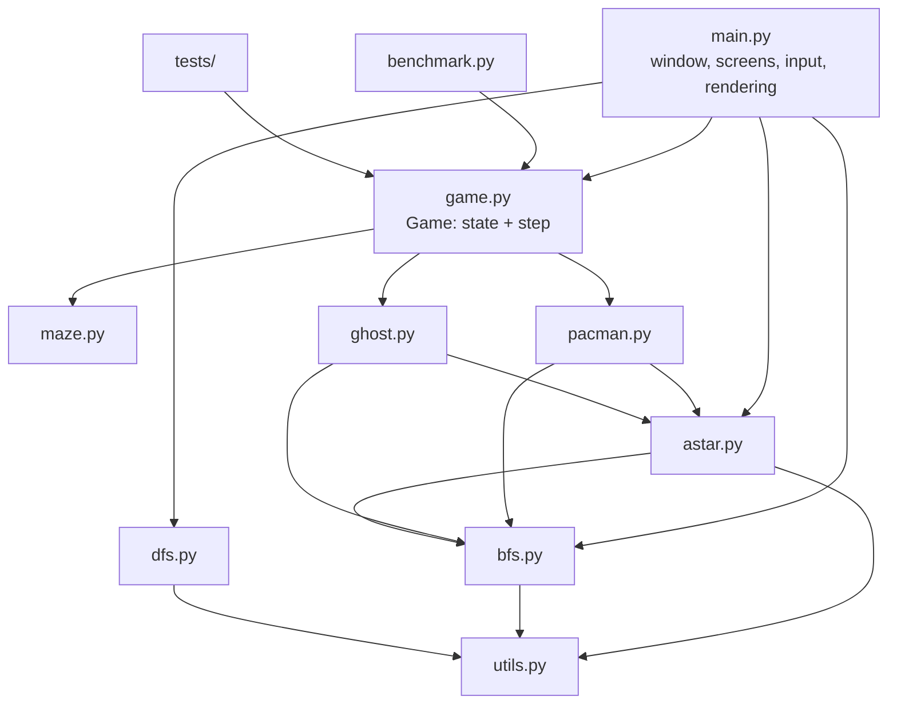

# Interview Preparation: Intelligent Pac-Man Agent (v2)

This guide covers the project **as it is now**, after the production pass: pull requests #2 to #5 on `github.com/soumyadip2412/Pacman`. Every number here comes from `python benchmark.py` or the test suite, and every `file:line` was checked against the code.

**The one-line version:** *"A Python/Pygame Pac-Man that plays itself with A\* search, avoids ghosts with a BFS danger zone, is covered by 48 automated tests with CI, and is deployed as a playable web page."*

**Contents**

1. The story: what you built and what you improved
2. 30 / 60 / 120-second pitches
3. Architecture
4. How Pac-Man decides (the core algorithm)
5. Search algorithms in depth
6. Ghosts
7. Game rules and the bugs you fixed
8. Testing, CI and deployment
9. Numbers you must know
10. "Show me the code" map
11. Interview questions and answers (54)
12. Traps and how to answer them
13. Honest limitations and what you would do next
14. Final 24-hour plan

---

# 1. The story: what you built and what you improved

Interviewers love a before/after story. You have a real one, and every step is a merged pull request.

| Step | Before | After | PR |
|---|---|---|---|
| Collision bugs | Two ghosts on one tick cost two lives. Pac-Man and a ghost could swap cells and pass through each other. Power pellets re-frightened ghosts every tick. | At most one life per tick. Moving into the cell a ghost just left counts as a hit. Ghosts are frightened once per power pellet. | #2 |
| Ghost avoidance | The README claimed it, but A\* never saw the ghosts. A nearby ghost only caused an identical replan. | Cells within 2 steps of a ghost are walls for planning. Pac-Man flees if no pellet is safely reachable. | #3 |
| Target choice | Pellet with the smallest **Manhattan** distance, up to 9 steps worse by real path. | Pellet nearest by **maze distance**, found with one multi-goal BFS. | #3 |
| Architecture | All rules inside the Pygame render loop, so nothing was testable. | Rules in `game.py` (`Game.step()`, no drawing); `main.py` only renders. | #4 |
| Quality | Zero tests, no CI, unseeded randomness, crash on a bad maze. | 48 pytest tests; ruff and pytest in GitHub Actions on Python 3.10 and 3.12; seeded replays; maze validation. | #4 |
| Delivery | Desktop only; README had wrong numbers. | pygbag WebAssembly build auto-deployed to GitHub Pages; README numbers reproducible with `benchmark.py`. | #5 |

**Measured impact of #3 (AI win rate):** Easy 8 → 12 of 12, Medium 6 → 11 of 12, Hard 0 → 6 of 12 (same seeds, before/after). With the final code over 40 seeds: **Easy 40/40, Medium 40/40, Hard 23/40.**

How to tell it: *"I audited my own project, found that the README overclaimed, and measured the gaps. Then I fixed them one pull request at a time, each with evidence: a headless simulation for the bug fixes, then tests and CI so they stay fixed."*

---

# 2. Pitches

**30 seconds.** "It's a Pac-Man game in Python where Pac-Man plays itself. It plans with A\* using Manhattan distance. It avoids ghosts by treating every cell within two steps of a ghost as a wall, and it goes for the pellet nearest by real maze distance. Ghosts chase it with BFS and A\*. It has 48 automated tests with CI, and it's deployed as a web page you can play."

**60 seconds.** Add: "Every tick Pac-Man perceives, plans and acts. One multi-source BFS from the ghosts gives a danger zone. A multi-goal BFS picks the nearest safe pellet, and A\* plans the path around the danger zone. If nothing is safe, it flees to the neighbouring cell furthest from the ghosts. On this maze A\* expands 34 nodes on average against 105 for BFS, with the same optimal paths. The agent wins every game on Easy and Medium and 23 of 40 on Hard."

**120 seconds.** Add the engineering: "I separated the game rules into a `Game` class with a `step()` method and no drawing. That made the rules testable headlessly and let me seed the randomness, so a seed replays a game exactly. Tests cover search optimality, collisions, power pellets, win and game over, and render smoke tests for every screen. CI runs lint and tests on two Python versions. The same loop is async, so pygbag compiles it to WebAssembly, and a workflow deploys it to GitHub Pages on every push to main."

---

# 3. Architecture

**Key design decisions**

- **`game.py` is the seam.** `Game` owns the maze, Pac-Man, ghosts, lives, `death_pause`, `game_over` and `won`. `Game.step()` (`game.py:109`) advances exactly one tick. `main.py` calls it once per frame and draws the result, while tests and `benchmark.py` call it with no window.
- **Search functions are duck-typed** against the maze: they only call `maze.get_neighbors(r, c)` (`maze.py:166`). That's why the same A\*/BFS code serves Pac-Man, ghosts, the comparison screen and the tests.
- **Determinism:** ghosts take a `random.Random(seed)` (`ghost.py:67`), so the same seed plus the same inputs gives the same game. A test asserts this over 1,500 ticks.
- **Async loop:** every screen does `await asyncio.sleep(0)` after drawing a frame, so the browser (pygbag) gets control back. On the desktop, `asyncio.run(run_game())` behaves like a normal loop.

**One tick, in order** (`game.py:109-150`):

1. If a death pause is running, count it down; when it ends, respawn Pac-Man and ghosts. Stop.
2. Record every ghost's position (needed for collision checks).
3. Pac-Man acts: perceive → plan → move, every 4th tick.
4. Pac-Man's power timer counts down.
5. Each ghost updates its mode timer, picks a target and moves on its own delay.
6. If a power pellet was eaten this tick, frighten all ghosts once.
7. Resolve collisions (eat frightened ghosts, lose at most one life).
8. Win check: no pellets left.

---

# 4. How Pac-Man decides

`PacMan.act()` (`pacman.py:217`) runs every tick but moves only every `PACMAN_MOVE_DELAY = 4` ticks. On a move tick it calls `plan(perceive(threats))` then follows the path. `main`/`game` pass only **non-frightened** ghosts as threats.

`plan()` (`pacman.py:141`) replans when the path is empty, about every 16 ticks (`REPLAN_TICKS = 15`, checked on move ticks), or when a ghost is within `DANGER_DIST = 4` Manhattan cells. Then:

1. **Danger zone.** `distance_map(maze, ghosts)` (`bfs.py:159`) is a multi-source BFS: one pass gives every cell's step distance to the nearest ghost. Cells with distance ≤ `DANGER_RADIUS = 2` become `blocked`, except Pac-Man's own cell so the search can always start.
2. **Target.** `nearest_reachable(maze, pos, pellets, blocked)` (`bfs.py:135`) is a multi-goal BFS. It pops cells in distance order, so the first pellet popped is the truly nearest one that avoids the zone. That is one O(V+E) search instead of one search per pellet.
3. **Path.** `astar_search(maze, pos, target, blocked)` (`astar.py:35`) treats blocked cells as walls.
4. **Flee.** If no pellet is reachable, `_flee_step` (`pacman.py:209`) picks, among the neighbours and staying still, the cell with the largest ghost distance from the same distance map.

**Why maze distance, not Manhattan, for the danger zone?** A ghost on the other side of a wall can be Manhattan-close but 20 steps away. BFS distance measures real threat.

**Why a radius of 2?** Ghosts move at most once per 4 to 15 ticks and Pac-Man every 4, so 2 steps gives a buffer of about one ghost move plus one Pac-Man move. It was checked empirically: win rates went from 8/6/0 to 12/11/6 out of 12.

**Why is the problem decomposed?** The true state for "eat everything" is (position, remaining-pellet set): 209 × 2^170 states. So the agent solves it greedily as nearest-pellet subgoals. It is optimal per subgoal, not globally.

---

# 5. Search algorithms in depth

## A\* (`astar.py:35`)

- **Open list:** `heapq` of `(f, g, node)` (`astar.py:60`, `:110`). **`g_score`** dict of best-known costs, **`came_from`** for the path, **`explored`** closed set.
- **Lazy deletion:** Python's `heapq` has no decrease-key. A better route to a node pushes a new entry, and stale entries are skipped on pop (`astar.py:77`).
- **Goal test on pop, not push:** when a node is popped it has the smallest f, so its g is optimal. Testing on push can accept a longer route.
- **Tie-break:** tuples compare element by element, so equal f pops the **lower g** first. `(f, -g, node)` would prefer deeper nodes and often expand fewer. It never changes optimality.
- **Heuristic:** Manhattan distance `|dr| + |dc|` (`utils.py:48`).
  - **Admissible:** with 4-way unit moves it is the exact cost without walls, and walls only add cost.
  - **Consistent:** adjacent cells differ by exactly 1 and a move costs 1, so h(n) ≤ 1 + h(n'). Consistency is what makes the closed set safe (no reopening needed).
  - **Euclidean** is also admissible here (never larger than Manhattan) but less informed, so A\* would expand more nodes.
- **Complexity:** O(E log V) with a binary heap in the worst case. Here V = 209 reachable cells and the average branching factor is 2.22.

## BFS (`bfs.py:31`)

- `deque` frontier with O(1) `popleft`; `came_from` doubles as the visited set.
- Optimal here because every move costs 1, so cells are expanded in order of distance. With weighted moves you'd need Uniform Cost Search (Dijkstra).
- Three extra forms in this project:
  - `bfs_next_step` (`bfs.py:98`), the ghosts' first step toward a target
  - `nearest_reachable` (multi-goal, `bfs.py:135`)
  - `distance_map` (multi-source, `bfs.py:159`)

## DFS (`dfs.py:30`)

- Explicit list stack (LIFO), iterative. It finds *a* path, not the shortest: only 12% of DFS paths are shortest, and on average they are 4.62x longer (up to 63x).
- It is used only as a baseline on the comparison screen.

## Why BFS and DFS show the same mean node count (105.5)

Averaged over **all** goals, both expand cells in an order that doesn't depend on the goal. So the goal's position in that order is uniform, and the mean is (N+1)/2 for both. A\* uses the goal through h, so it expands far fewer.

---

# 6. Ghosts (`ghost.py`)

| Ghost | Search | Chase target |
|---|---|---|
| Blinky | BFS | Pac-Man's cell |
| Pinky | A\* | 4 cells ahead in the direction Pac-Man last moved |
| Inky | A\* | Pac-Man's cell (same target as Blinky, different search) |
| Clyde | BFS | Pac-Man if more than 8 Manhattan cells away, else its home corner |

- **Modes:** chase for 300 ticks, then scatter to a home corner for 150 (`ghost.py:32-33`). **Frightened** (200 ticks): random neighbour from the seeded RNG.
- **Speed:** each ghost moves every `move_delay` ticks. The difficulty base (Easy 14, Medium 10, Hard 6) plus offsets of −2 / 0 / +1 / −1 (`game.py` `GHOST_SPECS`).
- **Honest note:** the ghosts are goal-based agents with a mode state machine, not "utility-based" as the old docs said. The ghost's `_next_step` cache is cleared after every move, so its `plan_every` timer never actually saves a search. That's a harmless inefficiency.

---

# 7. Game rules and the bugs you fixed (`game.py`)

**Collision rule** (`game.py:152`): a ghost touches Pac-Man if they share a cell now, **or** if Pac-Man's new cell is the cell the ghost was on before it moved. The second case catches swaps and pass-throughs, because Pac-Man moves before the ghosts in the tick. On a non-frightened hit the loop `break`s, so at most one life is lost per tick.

**Power pellets:** `_collect_pellet` sets `power_just_activated`. `step()` frightens every ghost once, then clears the flag. The old code frightened all non-frightened ghosts on *every* powered tick, so an eaten ghost respawned frightened again with a fresh 200 ticks.

**How the fixes were proven:** a headless harness ran the real loop for 36 games before and 36 after, auditing every tick. It found 89 bug occurrences before (2 multi-hit ticks, 20 missed touches, 67 re-frightens) and 0 after. These cases are now permanent tests (`tests/test_game.py`).

**Death and game over:** a hit starts a 60-tick `death_pause` (the death animation). The end screen appears when `game.finished` is true (game over *and* the pause is done).

---

# 8. Testing, CI and deployment

**48 tests, about 9 seconds** (`pytest`):

| File | What it proves |
|---|---|
| `test_search.py` | A\* and BFS give equal-length valid paths on 300 random pairs; A\* never expands more than BFS; DFS paths are valid and never shorter; unreachable goal → empty; `blocked` is respected; `nearest_reachable` is truly nearest, including the 9-step Manhattan counter-example |
| `test_maze.py` | Maze facts (22×21, 166 + 4 pellets, 209 reachable), every pellet reachable, neighbour correctness; 7 invalid layouts rejected with clear errors |
| `test_pacman.py` | Plans to a pellet; path keeps more than 2 steps from ghosts; stays put when boxed in; flees away from a ghost guarding the last pellet; moves every 4th tick; scoring |
| `test_game.py` | One life per tick; swap is a hit; frighten once and eaten ghosts respawn normal; death pause and respawn; game over; win; **same seed = same game**; restart; the AI clears the real maze on Easy and Medium |
| `test_render.py` | Headless smoke tests: full game loop with scripted keys, start screen (Enter and Esc), end screen, comparison screen, panel in every state |

**How rendering is tested without a screen:** `SDL_VIDEODRIVER=dummy`, with `pygame.event.get` and `Clock` monkeypatched to feed scripted events. Writing this test found a real bug: cached fonts from a previous pygame session segfaulted on a second `run_game`. The fix clears the font cache on init.

**CI** (`.github/workflows/ci.yml`): Python 3.10 and 3.12, `ruff check .` then `pytest`, on every push and pull request.

**Deployment** (`.github/workflows/pages.yml`): on push to `main` it runs the tests, then `pygbag --build` compiles the game to WebAssembly (CPython and pygame in the browser). `peaceiris/actions-gh-pages` then publishes `build/web` to the `gh-pages` branch, which GitHub Pages serves. For pygbag, the game loop must yield each frame (`await asyncio.sleep(0)`), and the UI text had to be ASCII for the browser's default font.

**Reproducibility:** `python benchmark.py` regenerates every README number in about 30 seconds, seeded.

---

# 9. Numbers you must know

| Fact | Value |
|---|---|
| Grid | 22 rows × 21 columns; 221 walkable cells, 209 reachable from the start |
| Collectibles | 166 pellets + 4 power pellets (+10 / +50; ghost +200) |
| Average branching factor | 2.22 |
| Mean nodes expanded, all 43,472 pairs | A\* **34.4**, BFS 105.5, DFS 105.5 |
| A\* vs BFS | A\* never expanded more on any pair; about 3x less work |
| DFS | shortest only 12% of the time; 4.62x longer on average, 63x worst |
| Manhattan vs true nearest pellet | up to 9 extra steps (from cell (10, 9)) |
| AI win rate, 40 seeds | Easy 40/40, Medium 40/40, Hard 23/40 |
| Lives lost per game | 0.20 / 0.45 / 2.15 |
| A\* nodes per real plan | about 5 to 8 (targets are usually close) |
| Timing | 30 FPS ticks; Pac-Man moves every 4 ticks; replans about every 16 ticks or when a ghost is within 4 |
| Tests | 48, about 9 s; CI on Python 3.10 and 3.12 |

---

# 10. "Show me the code" map

| Topic | Where |
|---|---|
| Entry point, window, event loop | `main.py:510` `run_game` (async) |
| Game state and one tick | `game.py:47` `Game`, `game.py:109` `step` |
| Collisions | `game.py:152` `_resolve_collisions` |
| Keyboard control | `game.py:182` `toggle_ai`, `game.py:187` `steer` |
| Pac-Man perceive / plan / act | `pacman.py:126`, `pacman.py:141`, `pacman.py:217` |
| Flee step | `pacman.py:209` |
| Pellet collection and power | `pacman.py:269` |
| A\* | `astar.py:35` (push `:60`, pop `:74`, stale skip `:77`, blocked `:99`) |
| Nearest-pellet planning | `astar.py:125` `astar_to_nearest_pellet` |
| Multi-goal BFS / distance map | `bfs.py:135` / `bfs.py:159` |
| BFS / DFS | `bfs.py:31` / `dfs.py:30` |
| Ghost target / update | `ghost.py:93` / `ghost.py:140` |
| Maze validation / neighbours | `maze.py:77` / `maze.py:166` |
| Heuristic | `utils.py:48` `manhattan_distance` |
| Comparison screen | `main.py:300` |
| Benchmarks | `benchmark.py` |

---

# 11. Interview questions and answers

## A. Project understanding

**A1. What does it do, in two sentences?** A self-playing Pac-Man where Pac-Man plans with A\* and avoids ghosts using a BFS danger zone, with BFS and DFS for comparison. It is tested, CI-checked and deployed as a web game.

**A2. Who is it for?** It's a demonstration of search and agent design that an examiner or recruiter can play in the browser. You can switch to manual play with the arrow keys.

**A3. What is the agent type?** A goal-based agent. The goal is to clear the pellets without being caught. It perceives (position, pellets, threatening ghosts), plans (danger zone, target, A\*) and acts (one move).

**A4. Is it AI if it doesn't learn?** Yes. Classical search and planning are core AI. Machine learning is one branch of it.

**A5. What was the hardest part?** Making ghost avoidance real. The first version replanned on danger but never gave A\* the ghosts. The fix needed both a safe target *and* a safe path, plus a fallback when nothing is safe.

**A6. What are you proudest of?** The evidence trail: each fix came with a measurement, and the measurements became tests.

**A7. What would you not claim?** That it is optimal overall (it's greedy per pellet) or that it predicts ghosts (it uses distance, not direction).

**A8. How do you know the numbers are right?** `benchmark.py` computes them from the real modules with fixed seeds, and anyone can rerun it.

## B. Architecture and design

**B1. Why extract `game.py`?** To separate rules from rendering. That made the rules testable without a window, made the game reproducible, and let the benchmark run thousands of games quickly.

**B2. What's the cleanest seam?** Search functions depend only on `get_neighbors`, so any graph with that method works.

**B3. Where does mutable state live?** In `Game` (tick, lives flags, death pause), the `Maze` pellet sets (mutated by `PacMan._collect_pellet`) and the agent objects. Rendering only reads them.

**B4. Why async?** pygbag runs Python in the browser's event loop. The game must yield each frame or the tab freezes. `await asyncio.sleep(0)` yields without slowing the desktop.

**B5. How is configuration organised?** Game constants live in `game.py` (FPS, difficulties, ghost specs, fright ticks) and agent constants at the top of `pacman.py` and `ghost.py`. One remaining improvement would be a single settings object.

**B6. How would you add a new algorithm to the comparison screen?** Any function `(maze, start, goal) -> (path, explored, metrics)` fits. Add it to the list in `comparison_screen`.

**B7. How would you add a new maze?** Pass a layout to `Maze(layout)` or `Game(layout=...)`. `validate_layout` rejects bad input with a clear message.

**B8. Why not an ECS or a game engine?** It would be overkill for 5 agents on a 22×21 grid. The design keeps the algorithms visible.

**B9. What makes a replay possible?** A seeded RNG plus deterministic tick order. Record the seed and the inputs and re-simulate.

**B10. What would you refactor next?** Split drawing out of `Maze`, `PacMan` and `Ghost` into a renderer module, so the model classes don't import pygame at all.

## C. Algorithms

**C1. Explain A\* and its data structures.** See section 5. Be ready to write it from memory in about 25 lines.

**C2. Prove Manhattan is admissible and consistent.** Admissible: it's the exact cost with no walls, and walls only add cost. Consistent: each move changes it by exactly 1 and costs 1.

**C3. Why goal test on pop?** On pop the node's g is optimal. On push you may accept a longer route.

**C4. Why lazy deletion?** `heapq` has no decrease-key. The trade-off is extra heap entries (memory) for simple code.

**C5. Why does A\* expand fewer nodes than BFS here?** h steers the search toward the goal. With an admissible, consistent h, A\* expands only nodes with f < C\* (plus some ties), while BFS expands everything closer than the goal in every direction.

**C6. When is BFS enough?** With unit costs and no useful heuristic, or when you need distances to many targets at once (multi-goal and multi-source forms).

**C7. Why is DFS in the project?** As an uninformed, non-optimal baseline on the comparison screen.

**C8. What is multi-source BFS?** Start the queue with all sources at distance 0. One pass gives each cell's distance to the nearest source: the ghost distance map.

**C9. How do you find the nearest of many targets?** Multi-goal BFS: stop at the first target popped. That's O(V+E), versus one A\* per target.

**C10. Complexity of one planning step?** Two BFS passes plus one A\*, each O(V+E) or O(E log V). With V = 209 that's well under a millisecond.

## D. Agent behaviour

**D1. How exactly does it avoid ghosts?** Cells within 2 BFS steps of a non-frightened ghost are walls for both target choice and path planning.

**D2. What if the only pellets are near ghosts?** It flees to the neighbour furthest from the nearest ghost, or stays put if staying is safest. Then it replans as ghosts move.

**D3. Why ignore frightened ghosts?** They can't hurt Pac-Man. Treating them as threats would waste power-pellet time.

**D4. Why does it still lose on Hard?** On Hard, Blinky moves as fast as Pac-Man and the others nearly as fast. The greedy plan can lead into dead ends that a ghost then closes off.

**D5. How would you make it smarter?** Predict ghost moves (use their direction or their own BFS next step), prefer pellets far from ghosts, or use expectimax or MCTS over a short horizon.

**D6. Why replan on a timer as well?** Ghosts move between plans. A periodic replan catches changes even when no ghost is within 4 cells.

## E. Game rules and bugs

**E1. Describe the swap bug and its fix.** Only final cells were compared, so a swap left them on different cells. The fix also checks whether Pac-Man moved into the ghost's previous cell.

**E2. Why could Pac-Man lose two lives at once?** The collision loop kept going after the first hit. The fix breaks after one life is lost.

**E3. What was wrong with power pellets?** Frighten ran every powered tick, so eaten ghosts came back frightened. Now it's event-based, once per pellet.

**E4. How did you prove the fixes?** A headless harness over 72 games counted each bug per tick: 89 occurrences before, 0 after. The cases are now unit tests.

**E5. What happens with a bad maze?** `validate_layout` raises `ValueError` naming the problem (for example, "maze needs exactly one 'P'"), instead of a crash deep inside the game.

## F. Testing and quality

**F1. What's your testing strategy?**
- Pure functions (search) get property-style tests over many random pairs.
- Game rules get small hand-built corridor mazes with frozen ghosts.
- Integration: the AI must clear the real maze.
- Smoke tests render every screen headlessly.

**F2. How do you test randomness?** Seed it. A test runs two games with the same seed for 1,500 ticks and asserts identical state every tick.

**F3. How do you test UI without a display?** SDL's dummy driver plus monkeypatched events and clock.

**F4. What did testing find?** A segfault when `run_game` ran twice: stale cached fonts after `pygame.quit()`.

**F5. What does CI check?** Ruff lint and all tests on Python 3.10 and 3.12, on every push and PR. Deploy also runs the tests first.

**F6. What isn't tested?** Visual correctness (pixels) and the browser build itself. The browser build is covered by the deploy job succeeding, not by a test.

## G. Deployment and production

**G1. How is it deployed?** The pygbag WebAssembly build is published to the `gh-pages` branch by GitHub Actions on every push to main. GitHub Pages serves it.

**G2. Why pygbag?** It runs CPython and pygame in the browser via WebAssembly, so the same code runs on desktop and web with no rewrite.

**G3. What did you change for the browser?** An async loop yielding each frame, no `sys.exit()`, and ASCII-only UI text.

**G4. Is it "production ready"?** For a game demo, yes: tested, linted, CI, reproducible, validated input, automated deploy. What's missing for a real product: telemetry, accessibility, sound, and cross-browser checks.

**G5. How do you avoid deploying a broken build?** The deploy job runs the test suite first, and every PR was merged only after CI went green. Branch protection could enforce that.

## H. Behavioural

**H1. Tell me about a time you found your own mistake.** The README claimed ghost avoidance that the code didn't do. I measured it, fixed it, and corrected the docs with measured numbers.

**H2. How do you prioritise?** Correctness bugs first, then the core claim (avoidance), then testability, then delivery.

**H3. How do you work with feedback?** Each change was a small PR with before/after evidence, easy to review.

**H4. What would you do with one more week?** See section 13.

---

# 12. Traps and how to answer them

| Trap | Strong answer |
|---|---|
| "So A\* always beats BFS?" | "Not always. On this maze it expanded fewer nodes on every pair, but the gain depends on the heuristic and the query. Both find optimal paths here." |
| "Your agent is optimal?" | "Per subgoal, yes. Overall, no: it's greedy nearest-pellet, because the full state space is 209 × 2^170." |
| "Does it predict ghosts?" | "No. It uses current ghost distance. Prediction is my next improvement." |
| "Tie-breaking prefers higher g?" | "No. `(f, g, node)` pops the lower g on ties. `(f, -g, node)` would prefer higher g." |
| "Euclidean overestimates on a grid?" | "No. It's never larger than Manhattan, so it's admissible, just less informed." |
| "Why do BFS and DFS have the same mean?" | "Averaged over all goals, both expand in a goal-independent order, so the mean rank is (N+1)/2." |
| "Is there a backend or database?" | "No. It's a client-side game. If I added online leaderboards, I'd add an API, auth and a DB." |
| "Where are the tests for the web build?" | "The deploy job builds it and runs the suite first. There's no browser test. I'd add a Playwright smoke test." |
| "Why radius 2?" | "It's a buffer of about one ghost move plus one Pac-Man move, validated by win rates. I'd tune it with the benchmark." |
| "Numbers came from where?" | "`benchmark.py`, seeded. Anyone can rerun it in 30 seconds." |

---

# 13. Honest limitations and what you would do next

**Limitations**

1. Greedy nearest-pellet planning, so it can walk into dead ends (Hard: 23/40).
2. Ghost threat uses distance only, not direction or predicted moves.
3. Pac-Man doesn't hunt frightened ghosts.
4. Model classes still contain drawing code, so they import pygame.
5. The ghost step cache never hits (harmless extra searches).
6. No browser test of the deployed build.

**One-week plan**

- Day 1: predict ghosts one step ahead (use each ghost's own next step).
- Day 2: score pellets by distance *and* safety.
- Day 3: chase frightened ghosts while powered.
- Day 4: move drawing into a renderer module.
- Day 5: Playwright smoke test of the deployed page.
- Days 6-7: tune `DANGER_RADIUS` and the delays with `benchmark.py`, and write up the results.

---

# 14. Final 24-hour plan

- **Hours 1-2:** read sections 1 to 4. Redraw the architecture and the tick order from memory.
- **Hours 3-4:** write `astar_search`, multi-goal BFS and multi-source BFS on paper.
- **Hours 5-6:** answer every question in section 11 out loud without notes.
- **Hours 7-8:** practise the traps in section 12 until each answer takes under 20 seconds.
- **Hour 9:** open the repo and walk through the code map in section 10. Run `pytest` and `python benchmark.py` once yourself.
- **Final hour:** practise the 30, 60 and 120-second pitches, the before/after story, and the live demo (browser link, `V` overlay, `C` comparison).

**Credibility rule:** say exactly what the code does and show the evidence. A small project explained precisely beats a big one explained vaguely.
