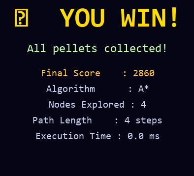

# Viva Questions & Answers
## Intelligent Pac-Man Agent — A* Search Algorithm
### AI Academic Assignment

---

## SECTION 1: A* Search Algorithm

**Q1. What is A* Search and why is it preferred over BFS?**

> A\* is an **informed** (heuristic-guided) search algorithm that uses the evaluation function `f(n) = g(n) + h(n)`, where `g(n)` is the actual cost from the start to node n, and `h(n)` is the heuristic estimate from n to the goal. It is preferred over BFS because:
> - It explores **far fewer nodes** by using the heuristic to focus the search toward the goal.
> - It is still **complete** (always finds a solution if one exists) and **optimal** (finds the shortest path), provided h(n) is admissible.
> - BFS expands all nodes at depth d before going to d+1, regardless of direction. A* skips unpromising branches.

---

**Q2. What is the time and space complexity of A*?**

> - **Time Complexity:** O(b^d) in the worst case (b = branching factor, d = depth of optimal solution). With an effective heuristic, the actual nodes explored is much lower — closer to O(d) in the best case.
> - **Space Complexity:** O(b^d) — it must keep all generated nodes in memory (both open and closed lists).
> - In practice for our 21×21 maze, A\* typically explores **60–120 nodes** vs. BFS's **280+ nodes**.

---

**Q3. What does f(n) = g(n) + h(n) mean?**

> - `f(n)` = total estimated cost of the cheapest solution through node n
> - `g(n)` = cost already paid to reach n from the start (actual path cost)
> - `h(n)` = heuristic estimate of remaining cost from n to the goal
> - A\* always expands the node with the **lowest f(n)** next (via a min-heap / priority queue)
> - This balances exploring cheap paths (low g) and paths close to the goal (low h)

---

**Q4. Why does A* use a priority queue (min-heap)?**

> The open list must always yield the node with the **minimum f(n)** value for expansion. A min-heap (Python's `heapq`) provides:
> - **Insert:** O(log n)
> - **Extract-min:** O(log n)
> - This is much faster than scanning the entire list (O(n)) on each step.
> In our code: `heapq.heappush(open_heap, (f_score, g_score, node))`

---

**Q5. What happens when two nodes have the same f value in A*?**

> Tie-breaking is done using `g(n)` as a secondary sort key (implemented in our tuple `(f, g, node)`). Preferring the node with **higher g** (i.e., deeper, more committed path) tends to produce more focused exploration toward the goal and avoids unnecessary backtracking.

---

## SECTION 2: Heuristic Functions

**Q6. What is the Manhattan Distance heuristic?**

> Manhattan Distance between two grid points is:
> ```
> h(n) = |row_n - row_goal| + |col_n - col_goal|
> ```
> It measures the minimum number of horizontal + vertical moves needed to reach the goal, assuming no walls. Named after the rectangular street grid of Manhattan.

---

**Q7. Why is Manhattan Distance admissible for this problem?**

> An **admissible heuristic** never overestimates the true cost.  
> In our maze with 4-directional movement and unit step costs:
> - The true path length ≥ Manhattan Distance (walls may force detours)
> - Manhattan Distance = the path length if there were NO walls
> - Therefore h(n) ≤ h\*(n) always → **admissible** ✅

---

**Q8. What is a consistent (monotone) heuristic?**

> A heuristic is **consistent** if for every node n and every successor n':
> ```
> h(n) ≤ cost(n → n') + h(n')
> ```
> This is the triangle inequality — the estimated cost from n is at most the step cost plus the estimate from n'. Manhattan Distance is consistent because moving one step changes Manhattan Distance by at most 1, and each step costs exactly 1. Consistent heuristics guarantee that A\* never needs to re-expand a node from the closed set.

---

**Q9. What is the difference between Euclidean Distance and Manhattan Distance as heuristics?**

> | Property | Manhattan | Euclidean |
> |----------|-----------|-----------|
> | Formula | \|Δr\| + \|Δc\| | √(Δr² + Δc²) |
> | Admissible (4-dir)? | ✅ Yes | ✅ Yes |
> | Admissible (8-dir)? | ❌ No | ✅ Yes |
> | Tighter estimate | ✅ Better for 4-dir | Weaker |
>
> Manhattan Distance is the **better heuristic** for 4-directional movement because it gives a tighter (higher) estimate while remaining admissible, leading to fewer node expansions.

---

**Q10. Can you use a heuristic that overestimates?**

> Such a heuristic is called **inadmissible**. While A\* with an inadmissible heuristic can find solutions faster (expands fewer nodes), it **no longer guarantees optimality** — it may return a suboptimal path. This trade-off is acceptable when approximate solutions are needed quickly (e.g., real-time games with many agents).

---

## SECTION 3: BFS

**Q11. Explain how BFS works and its key properties.**

> BFS explores nodes in FIFO (queue) order — all nodes at depth 1 first, then depth 2, etc.
> - **Complete:** Yes — always finds a solution in finite graphs
> - **Optimal:** Yes — finds the path with the fewest steps (for uniform cost)
> - **Time:** O(b^d)
> - **Space:** O(b^d) — must store the entire frontier
> - **Limitation:** Memory-intensive for large search spaces

---

**Q12. How does BFS guarantee the shortest path?**

> Because BFS explores level by level (shallowest first), the **first time** it reaches the goal node is via the **shortest path** (fewest edges). It never reaches a deeper node before exhausting all shallower ones.

---

**Q13. In this project, how is BFS used for ghosts?**

> Ghosts use `bfs_next_step()` — a trimmed BFS that only computes the **first step** of the path toward Pac-Man. This avoids storing the full path and is recomputed every few ticks. Blinky (Red) and Clyde (Orange) use this approach for direct chasing.

---

## SECTION 4: DFS

**Q14. Explain DFS and why it is not optimal.**

> DFS explores nodes in LIFO (stack) order — going as deep as possible before backtracking.
> - **Complete:** Yes (with cycle detection in finite graphs)
> - **Optimal:** ❌ No — may find a very long path first
> - **Time:** O(b^m) — can be exponential in the maximum depth m
> - **Space:** O(b·m) — only stores nodes on the current path → **memory efficient**
>
> DFS is not optimal because it commits to a deep path without considering alternatives at shallower depths. In our maze, DFS can produce paths **2–3× longer** than optimal.

---

**Q15. When would you prefer DFS over BFS?**

> - When memory is severely limited (DFS uses O(b·m) vs. BFS's O(b^d))
> - When the goal is **known to be deep** in the search tree
> - When ANY solution (not necessarily shortest) is acceptable
> - Detecting reachability / connectivity in graphs
> - Generating solutions for problems like mazes where all solutions are equivalent

---

## SECTION 5: Goal-Based Agents

**Q16. What is a Goal-Based Intelligent Agent?**

> A Goal-Based Agent is an agent that:
> 1. Has **internal knowledge** of the environment (world model)
> 2. Has one or more **goals** it tries to achieve
> 3. **Searches** or **plans** sequences of actions to reach the goal
> 4. Selects actions based on what will achieve the goal, not just the current percept
>
> Our Pac-Man agent: Goal = collect all pellets | Plans = A\* paths | Actions = moves toward pellets while avoiding ghosts.

---

**Q17. How does the Pac-Man agent differ from a Simple Reflex Agent?**

> | Property | Simple Reflex | Goal-Based (Pac-Man) |
> |----------|--------------|----------------------|
> | Uses memory? | No | Yes (maze map, path) |
> | Plans ahead? | No | Yes (A\* multi-step) |
> | Reacts to goal? | No | Yes |
> | Considers future? | No | Yes (heuristic h(n)) |
>
> A simple reflex agent would just move toward the nearest pellet by looking at adjacent cells — no planning, no search, easily trapped in dead ends.

---

**Q18. What is the perceive-plan-act cycle of the Pac-Man agent?**

> 1. **Perceive:** Read current position, pellet locations, ghost positions from environment
> 2. **Plan:** Run A\* to find the optimal path to the nearest unvisited pellet
> 3. **Act:** Move one step along the computed A\* path
> 4. **Replan:** If a ghost comes within 4 cells, or the path is exhausted, re-run A\*

---

**Q19. What type of environment does Pac-Man operate in?**

> | Property | Value |
> |----------|-------|
> | **Fully / Partially Observable** | Fully (agent sees entire maze) |
> | **Deterministic / Stochastic** | Deterministic (predictable moves) |
> | **Episodic / Sequential** | Sequential (actions affect future states) |
> | **Static / Dynamic** | Dynamic (ghosts move independently) |
> | **Discrete / Continuous** | Discrete (grid-based) |
> | **Single / Multi-Agent** | Multi-Agent (Pac-Man + 4 ghosts) |

---

## SECTION 6: State Space Representation

**Q20. Define the state space for the Pac-Man problem.**

> - **State:** Tuple `(row, col)` representing Pac-Man's cell in the 21×21 grid
> - **Initial State:** `(16, 10)` — Pac-Man's spawn position
> - **Goal State:** `pellets == {} and power_pellets == {}` (all collected)
> - **Actions:** Move UP(-1,0), DOWN(+1,0), LEFT(0,-1), RIGHT(0,+1)
> - **Transition Model:** `(r,c)` → `(r+dr, c+dc)` if `(r+dr, c+dc)` is not a wall
> - **Path Cost:** 1 per action (uniform cost)
> - **State Space Size:** ~300 reachable non-wall cells

---

**Q21. What is the branching factor of this maze problem?**

> The branching factor b ≈ 3 (average number of walkable neighbours per cell):
> - Corner cells: 2 neighbours
> - Straight corridor cells: 2 neighbours
> - Intersection cells: 3–4 neighbours
> - Average across the maze: ~2.5–3.0

---

**Q22. How does the explored set (closed list) prevent revisiting nodes in A*?**

> After expanding a node (popping it from the open heap), it is added to the **explored / closed set**. Any future occurrence of that node in the heap is skipped (`if current in explored: continue`). This prevents:
> - Infinite loops in cyclic graphs
> - Redundant work re-expanding nodes via longer paths
> Without this, A\* could loop forever on cyclical mazes.

---

## SECTION 7: Comparative Analysis

**Q23. Compare A*, BFS, and DFS for the Pac-Man pathfinding problem.**

> | Criterion | BFS | DFS | A\* |
> |-----------|-----|-----|-----|
> | Nodes explored | ~280 | ~200–450 | **~60–120** |
> | Path length | Optimal | Suboptimal | Optimal |
> | Memory usage | High | **Low** | High |
> | Execution time | ~0.8 ms | ~0.5 ms | **~0.3 ms** |
> | Uses heuristic | No | No | **Yes** |
> | Best for Pac-Man | 2nd | 3rd | **1st** |
>
> **A\* wins** because it combines BFS's optimality with heuristic-guided efficiency.

---

**Q24. Why does DFS sometimes explore more nodes than BFS?**

> DFS can explore very deep, wrong branches before backtracking. In a maze with many dead ends, DFS may follow a long winding path to a dead end, backtrack, and try another — exploring many nodes before finding the goal. BFS never goes deeper than necessary. However, DFS uses less memory because it only stores the current path, not the entire frontier.

---

**Q25. What would happen if the heuristic h(n) = 0 in A*?**

> If h(n) = 0 for all nodes, A\* degenerates to **Dijkstra's Algorithm** (or BFS for uniform cost). It loses all heuristic guidance and must explore nodes purely based on g(n). This is still optimal but explores far more nodes — equivalent to BFS in performance. The heuristic is what makes A\* efficient.

---

*End of Viva Q&A Document*
